<div align="center">

# DustiniaDelixia: Customer Analytics Platform


**End-to-end Customer Analytics Platform** untuk menganalisis performa pelanggan, pengalaman transaksi, dan segmentasi customer dari dataset e-commerce Brazil (Olist)

</div>

---

## Table of Contents

1. [Perkenalan](#-1-perkenalan)
2. [Key Performance Index](#-2-key-performance-index)
3. [Data Engineering Pipeline](#-3-data-engineering-pipeline)
4. [Overview Dashboard Analytics](#-4-overview-dashboard-analytics)
5. [Customer Performance Overview](#-5-customer-performance-overview)
6. [Customer Segmentation](#-6-customer-segmentation)
7. [Customer Experience Analytics](#-7-customer-experience-analytics)
8. [Customer Behavior Drivers](#-8-customer-behavior-drivers)
9. [Geo & Seller Analytics](#-9-geo--seller-analytics)
10. [NLP: Keyword Extraction & Sentiment Score](#-10-nlp-keyword-extraction--sentiment-score-coming-soon)
11. [Insight & Strategi Bisnis](#-11-insight--strategi-bisnis)
12. [Penutup](#-12-penutup)

---

## 1. Perkenalan

<table align="center">
  <tr>
    <td align="center" width="320">
      <b>Ibrahim Ferel</b><br>
      <code>5025241049</code>
    </td>
  </tr>
</table>

### Tentang Project

**DustiniaDelixia Customer Performance Analytics Platform** adalah pipeline data end-to-end yang dibangun untuk menganalisis perilaku, performa, dan pengalaman pelanggan secara komprehensif menggunakan dataset e-commerce Brazil dari Olist yang diberikan oleh para **Admin Manajemen Cerdas Informasi.**

Platform ini menjawab pertanyaan bisnis kritis seperti:

- Siapa pelanggan paling berharga dan paling loyal?
- Apa faktor utama yang memengaruhi kepuasan dan pengalaman pelanggan (CX Score)?
- Di mana distribusi pelanggan dan revenue terkonsentrasi secara geografis?
- Topik komplain apa yang paling sering muncul, dan bagaimana pengaruhnya terhadap rating?

### Stack Teknologi

| Layer | Teknologi | Fungsi |
|---|---|---|
| Ingestion | Python + Pandas | Fetch dataset CSV -> Parquet |
| Processing | Apache Spark (PySpark) | Feature engineering skala besar |
| Orchestration | Apache Airflow | DAG scheduling & monitoring |
| Warehouse | ClickHouse | OLAP storage & query engine |
| Visualization | Metabase | Interactive dashboard |
| NLP | DistilBERT + KeyBERT | Sentiment & keyword extraction *(coming soon)* |
| Infrastructure | Docker Compose | Containerized deployment (Penyesuaian Settingan Docker dengan Modul Hands On) |

### Dataset

Dataset yang digunakan adalah **Olist Brazil E-Commerce Dataset** dengan 7 file CSV:


1. orders.csv          
2. order_items.csv     
3. order_payments.csv
4. order_reviews.csv   
5. customers.csv       
6. sellers.csv
7. geolocation.csv

---

## 2. Key Performance Index

KPI project ini dibagi ke dalam **6 Program Kerja** dengan total bobot program = 1.0.

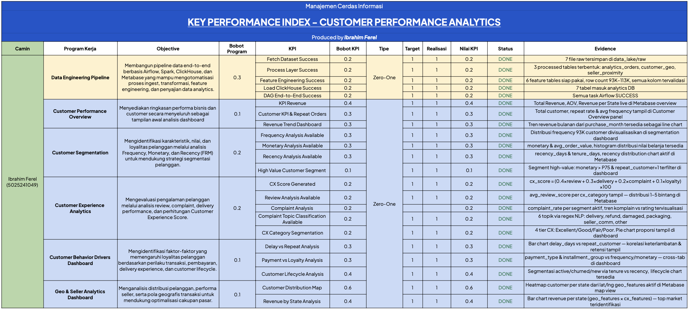

### Rekap KPI

| Program Kerja | Bobot | Status |
|---|---|---|
| Data Engineering Pipeline |  | ✅ Done |
| Customer Performance Overview |  | ✅ Done |
| Customer Segmentation | | ✅ Done |
| Customer Experience Analytics | | ✅ Done |
| Customer Behavior Drivers Dashboard | | ✅ Done |
| Geo & Seller Analytics Dashboard | | ✅ Done |
| NLP: Keyword Extraction & Sentiment Score | | ✅ Done |

---

## 3. Data Engineering Pipeline

### Arsitektur Pipeline

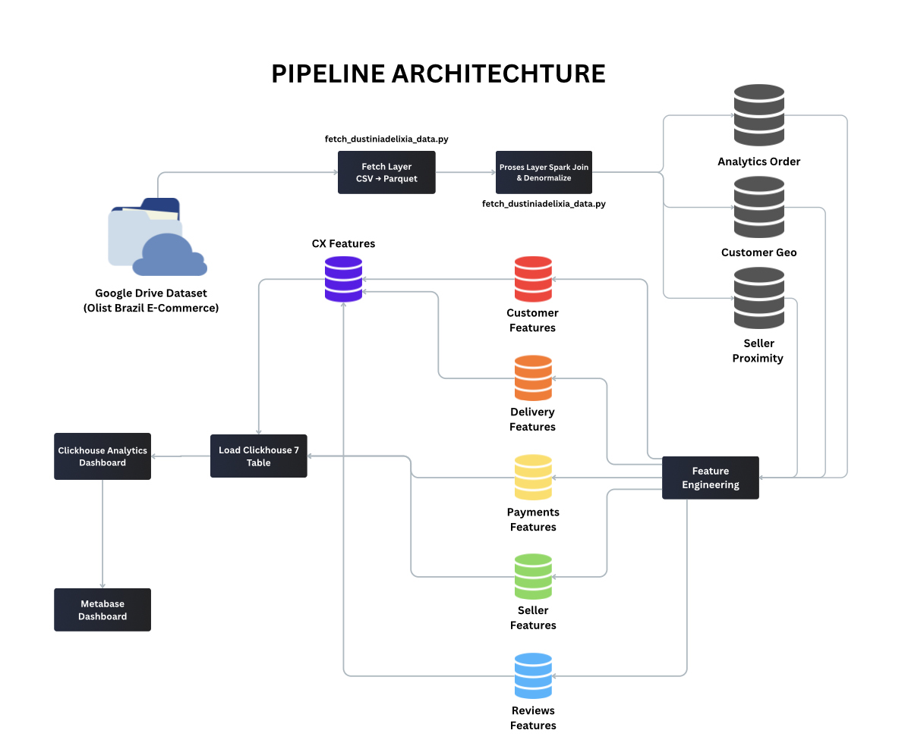
Source: https://canva.link/w7njlxzh9dh1fxc

### DAG Orchestration

File: `dustiniadelixia_pipeline.py`


```
fetch_data >> process_data

    process_data >> [
        customer_features,
        delivery_features,
        payment_features,
        seller_features,
        nlp_features
    ]

    [
        customer_features,
        delivery_features,
        nlp_features
    ] >> cx_features

    [
        customer_features,
        delivery_features,
        payment_features,
        seller_features,
        nlp_features,
        cx_features,
        process_data
    ] >> load_clickhouse
```

Seluruh feature engineering berjalan **paralel** setelah `process_data` selesai, kemudian `cx_features` dan `load_clickhouse` menunggu semua upstream task sukses.

---

### Layer 1: Fetch Layer

**Script:** `fetch_dustiniadelixia_data.py`

Mengambil dataset ZIP dari Google Drive, mengekstrak CSV, dan mengkonversi ke Parquet. Sebelum masuk ke tahap orkestrasi, saya coba jalankan di local terlebih dahulu.

```
ZIP -> Extract -> CSV -> Parquet -> data_lake/raw/
```


**Output struktur:**

```
raw/
├── orders/orders.parquet
├── order_items/order_items.parquet
├── customers/customers.parquet
├── sellers/sellers.parquet
├── geolocation/geolocation.parquet
├── order_reviews/order_reviews.parquet
└── order_payments/order_payments.parquet
```

---

### Layer 2: Processing Layer

**Script:** `process_dustiniadelixia_spark.py`

Melakukan join antar tabel raw untuk menghasilkan 3 denormalized tables yang digunakan oleh semua feature engineering scripts.


| Output Table | Join Sources | Digunakan Oleh |
|---|---|---|
| `analytics_orders` | orders + items + payments + reviews + customers | Customer, Delivery, Payment, NLP, CX FE |
| `customer_geo` | customers + geolocation | Geo Analytics |
| `seller_proximity` | orders + items + customers + sellers | Seller-Customer Analytics |

---

### Layer 3: Feature Engineering

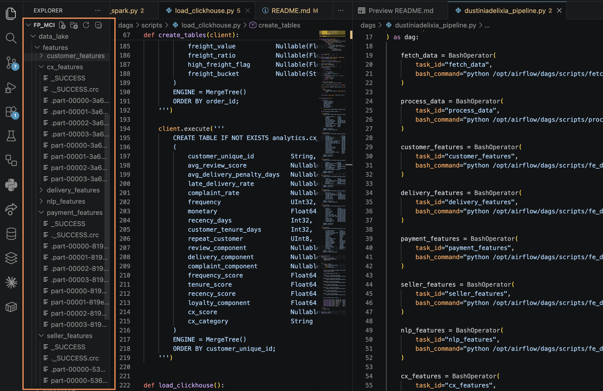

6 script FE berjalan paralel, masing-masing menghasilkan 1 feature table:

| Script | Output Table | Row Count | Key Features |
|---|---|---|---|
| `fe_customer.py` | `customer_features` | 93,358 | frequency, monetary, recency_days, tenure_days, repeat_customer |
| `fe_delivery.py` | `delivery_features` | 99,992 | actual_delivery_days, delivery_delay_days, delay_bucket, cancellation_flag |
| `fe_payment.py` | `payment_features` | 99,440 | payment_type, installment_group, multi_payment_flag, high_value_flag |
| `fe_seller.py` | `seller_features` | 113,425 | same_state, freight_ratio, interstate_order, high_freight_flag |
| `fe_nlp.py` | `nlp_features` | 99,992 | complaint_topic, review_text_clean, has_text |
| `fe_cx.py` | `cx_features` | 93,358 | cx_score, cx_category, loyalty_component, semua sub-score |

---

### CX Score Formula

```
cx_score = (
    review_component    × 0.4  +
    delivery_component  × 0.3  +
    complaint_component × 0.2  +
    loyalty_component   × 0.1
) × 100
```

**Loyalty Component** adalah composite dari 3 sub-score:

```
loyalty_component = frequency_score × 0.5
                  + tenure_score    × 0.3
                  + recency_score   × 0.2
```

| Komponen | Skala | Threshold |
|---|---|---|
| `review_component` | 0.0–1.0 | `avg_review_score / 5.0` |
| `delivery_component` | 0.3–1.0 | ≤0 hari=1.0, ≤3=0.8, ≤7=0.6, else=0.3 |
| `complaint_component` | 0.0–1.0 | `1 - complaint_rate` |
| `frequency_score` | 0.2–1.0 | freq≥5=1.0, 4=0.8, 3=0.6, 2=0.4, else=0.2 |
| `tenure_score` | 0.2–1.0 | ≥365d=1.0, ≥180=0.8, ≥90=0.6, ≥30=0.4, else=0.2 |
| `recency_score` | 0.2–1.0 | ≤30d=1.0, ≤90=0.8, ≤180=0.6, ≤365=0.4, else=0.2 |

**CX Category:**

```
Excellent : cx_score ≥ 90
Good      : cx_score ≥ 70
Fair      : cx_score ≥ 50
Poor      : cx_score < 50
```

---

### NLP: Complaint Topic Classification

Complaint topic diklasifikasikan menggunakan **regex-based NLP** dari teks ulasan pelanggan (Bahasa Portugis):

| Topik | Regex Keywords | Count |
|---|---|---|
| `delivery` | entrega, atraso, prazo, recebi, correio, rastreio, ... | ~17,128 |
| `seller_communication` | vendedor, atendimento, suporte, resposta, contato, ... | ~978 |
| `packaging` | embalagem, caixa, pacote, embalado, rasgada, ... | ~538 |
| `damaged_product` | defeito, quebrado, danificado, avariado, falha, ... | ~440 |
| `refund` | devolver, estorno, reembolso, cancelar, troca, ... | ~270 |
| `other` | *(semua yang tidak match regex di atas)* | ~80,638 |

---

### Proof: Airflow DAG Success

*Screenshot DAG Airflow semua task SUCCESS:*

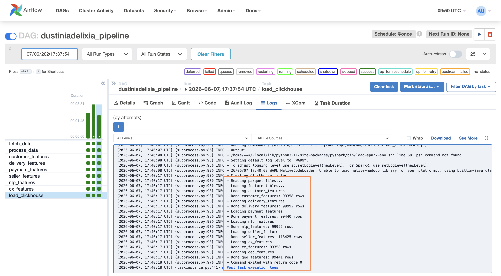

---

### Proof: ClickHouse Data Verified

```sql
SELECT 'customer_features'  AS table_name, count() AS rows FROM analytics.customer_features
UNION ALL SELECT 'delivery_features',  count() FROM analytics.delivery_features
UNION ALL SELECT 'payment_features',   count() FROM analytics.payment_features
UNION ALL SELECT 'nlp_features',       count() FROM analytics.nlp_features
UNION ALL SELECT 'seller_features',    count() FROM analytics.seller_features
UNION ALL SELECT 'cx_features',        count() FROM analytics.cx_features
UNION ALL SELECT 'geo_features',       count() FROM analytics.geo_features
ORDER BY rows DESC;
```

*Screenshot hasil query ClickHouse:*

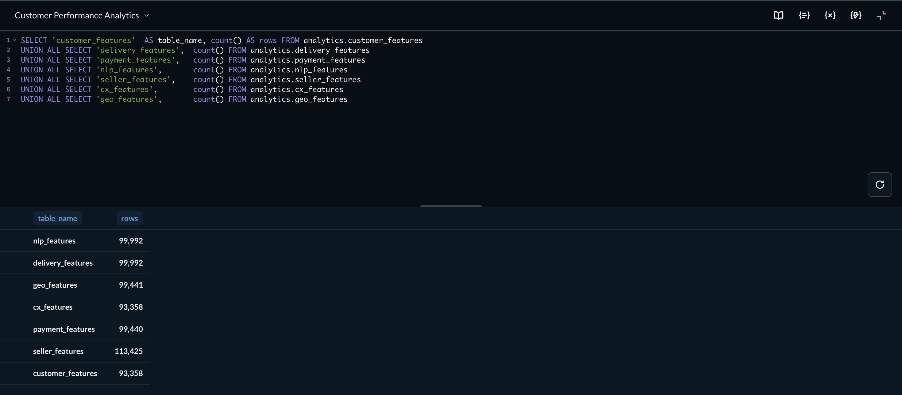

---

## 📈 4. Overview Dashboard Analytics

Dashboard Metabase dibagi ke dalam **5 halaman utama**, masing-masing memetakan langsung ke program kerja KPI.

| Halaman | Sumber Data | Jumlah Chart |
|---|---|---|
| Customer Performance Overview | `customer_features`, `delivery_features` | 3 |
| Customer Segmentation | `customer_features` | 4 |
| Customer Experience Analytics | `cx_features`, `nlp_features` | 5 |
| Customer Behavior Drivers | `delivery_features`, `payment_features`, `customer_features` | 3 |
| Geo & Seller Analytics | `geo_features`, `customer_features`, `seller_features` | 2 |

---

## 5. Customer Performance Overview

Halaman ini menyajikan ringkasan KPI bisnis tingkat atas: revenue, customer base, dan tren waktu sebagai entry point analisis.

> *Screenshot Customer Performance Overview dashboard*

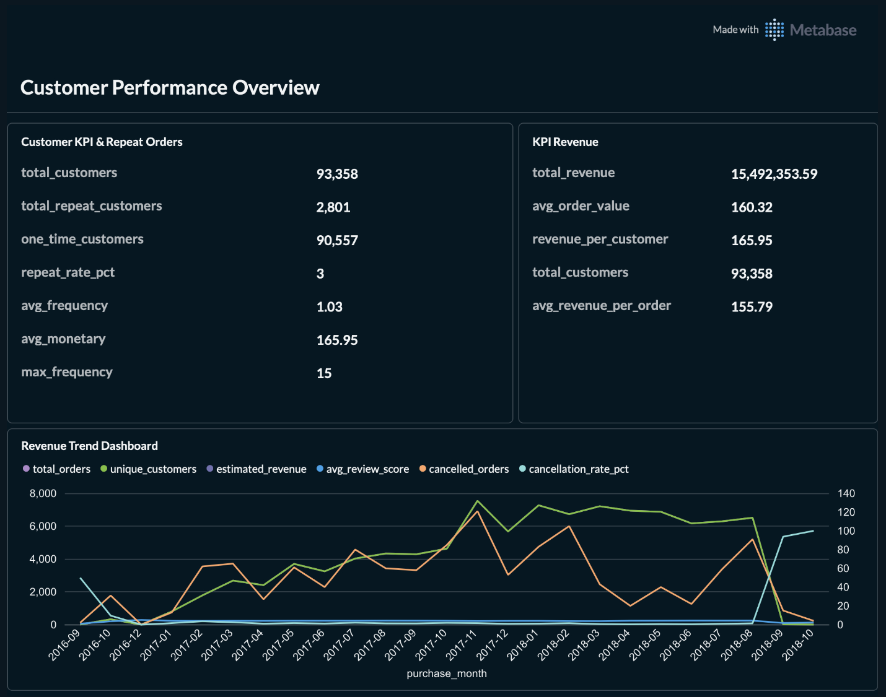

### Query yang Digunakan

**[CPO-1] KPI Revenue - Total Revenue, AOV, Total Customers**
```sql
SELECT
    ROUND(SUM(monetary), 2)                         AS total_revenue,
    ROUND(AVG(avg_order_value), 2)                  AS avg_order_value,
    COUNT(DISTINCT customer_unique_id)               AS total_customers,
    ROUND(SUM(monetary)
        / COUNT(DISTINCT customer_unique_id), 2)    AS revenue_per_customer
FROM analytics.customer_features;
```


---

**[CPO-2] Customer KPI & Repeat Orders**
```sql
SELECT
    COUNT(DISTINCT customer_unique_id)              AS total_customers,
    SUM(repeat_customer)                            AS total_repeat_customers,
    ROUND(SUM(repeat_customer) * 100.0
        / COUNT(DISTINCT customer_unique_id), 2)    AS repeat_rate_pct,
    ROUND(AVG(frequency), 2)                        AS avg_frequency,
    ROUND(AVG(monetary), 2)                         AS avg_monetary
FROM analytics.customer_features;
```


---

**[CPO-3] Revenue Trend Dashboard - Line Chart Bulanan**
```sql
SELECT
    d.purchase_month,
    COUNT(DISTINCT d.order_id)                      AS total_orders,
    COUNT(DISTINCT d.customer_id)                   AS unique_customers,
    ROUND(AVG(toFloat64(d.review_score)), 2)        AS avg_review_score,
    SUM(d.cancellation_flag)                        AS cancelled_orders,
    ROUND(SUM(d.cancellation_flag) * 100.0
        / COUNT(DISTINCT d.order_id), 2)            AS cancellation_rate_pct
FROM analytics.delivery_features d
WHERE d.purchase_month IS NOT NULL
GROUP BY d.purchase_month
ORDER BY d.purchase_month ASC;
```
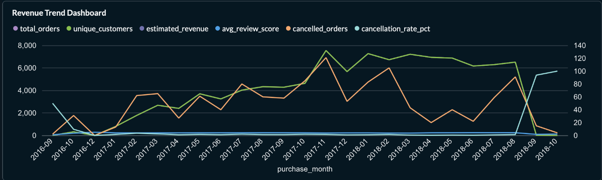-

---

## 6. Customer Segmentation

Halaman ini menganalisis karakteristik pelanggan melalui dimensi **Frequency**, **Monetary**, dan **Recency** (FRM) untuk mendukung strategi segmentasi yang tepat sasaran.

> *Screenshot Customer Segmentation dashboard*


### Query yang Digunakan

**[SEG-1] Frequency Distribution**
```sql
SELECT
    frequency,
    COUNT(DISTINCT customer_unique_id)              AS total_customers,
    ROUND(COUNT(DISTINCT customer_unique_id) * 100.0
        / SUM(COUNT(DISTINCT customer_unique_id)) OVER (), 2)
                                                    AS pct_customers,
    ROUND(AVG(monetary), 2)                         AS avg_monetary
FROM analytics.customer_features
GROUP BY frequency
ORDER BY frequency ASC;
```
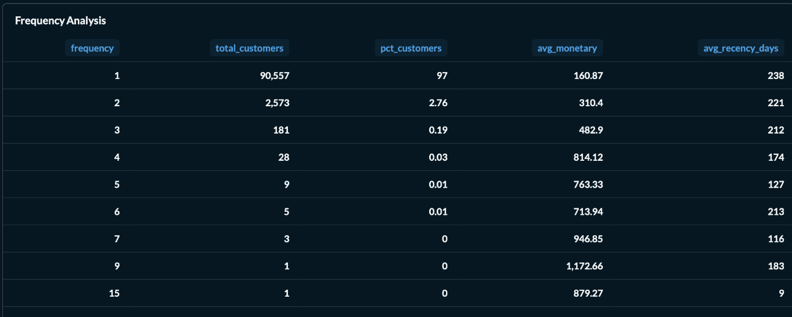-

---

**[SEG-2] Monetary Distribution (Bucket)**
```sql
SELECT
    CASE
        WHEN monetary < 50    THEN '< 50'
        WHEN monetary < 200   THEN '50–199'
        WHEN monetary < 500   THEN '200–499'
        WHEN monetary < 1000  THEN '500–999'
        WHEN monetary < 3000  THEN '1K–2.9K'
        ELSE                       '3K+'
    END                                             AS monetary_bucket,
    COUNT(DISTINCT customer_unique_id)              AS total_customers,
    ROUND(AVG(monetary), 2)                         AS avg_monetary,
    ROUND(AVG(avg_order_value), 2)                  AS avg_order_value
FROM analytics.customer_features
GROUP BY monetary_bucket
ORDER BY MIN(monetary) ASC;
```
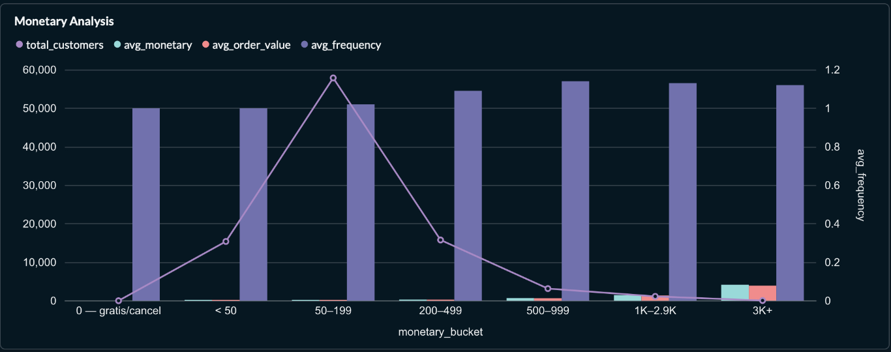

---

**[SEG-3] Recency Distribution**
```sql
SELECT
    CASE
        WHEN recency_days <= 30   THEN '≤ 30 hari (Hot)'
        WHEN recency_days <= 90   THEN '31–90 hari (Warm)'
        WHEN recency_days <= 180  THEN '91–180 hari (Cooling)'
        WHEN recency_days <= 365  THEN '181–365 hari (Cold)'
        ELSE                           '> 365 hari (Dormant)'
    END                                             AS recency_segment,
    COUNT(DISTINCT customer_unique_id)              AS total_customers,
    ROUND(AVG(monetary), 2)                         AS avg_monetary,
    ROUND(AVG(frequency), 2)                        AS avg_frequency
FROM analytics.customer_features
GROUP BY recency_segment
ORDER BY MIN(recency_days) ASC;
```


---

**[SEG-4] High Value Customer Segmentation**
```sql
SELECT
    customer_unique_id,
    frequency,
    ROUND(monetary, 2)                              AS monetary,
    ROUND(avg_order_value, 2)                       AS avg_order_value,
    recency_days,
    customer_tenure_days,
    preferred_payment_type,
    CASE
        WHEN monetary >= (SELECT quantile(0.95)(monetary)
                          FROM analytics.customer_features)
             THEN 'Top 5%'
        WHEN monetary >= (SELECT quantile(0.90)(monetary)
                          FROM analytics.customer_features)
             THEN 'Top 10%'
        ELSE 'Top 25%'
    END                                             AS value_tier
FROM analytics.customer_features
WHERE repeat_customer = 1
  AND monetary >= (
      SELECT quantile(0.75)(monetary)
      FROM analytics.customer_features
  )
ORDER BY monetary DESC
LIMIT 200;
```


---

## 7. Customer Experience Analytics

Halaman ini mengevaluasi pengalaman pelanggan melalui empat dimensi: review score, complaint rate, delivery performance, dan loyalty, dikombinasikan menjadi satu **CX Score (0–100)**.

> *Screenshot Customer Experience Analytics dashboard*

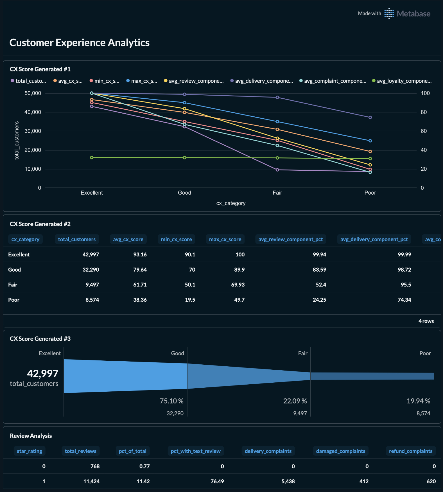


### Query yang Digunakan

**[CX-1] CX Score Generated**
```sql
SELECT
    cx_category,
    COUNT(DISTINCT customer_unique_id)              AS total_customers,
    ROUND(AVG(cx_score), 2)                         AS avg_cx_score,
    ROUND(MIN(cx_score), 2)                         AS min_cx_score,
    ROUND(MAX(cx_score), 2)                         AS max_cx_score,
    ROUND(AVG(review_component) * 100, 2)           AS avg_review_pct,
    ROUND(AVG(delivery_component) * 100, 2)         AS avg_delivery_pct,
    ROUND(AVG(complaint_component) * 100, 2)        AS avg_complaint_pct,
    ROUND(AVG(loyalty_component) * 100, 2)          AS avg_loyalty_pct
FROM analytics.cx_features
GROUP BY cx_category
ORDER BY avg_cx_score DESC;
```
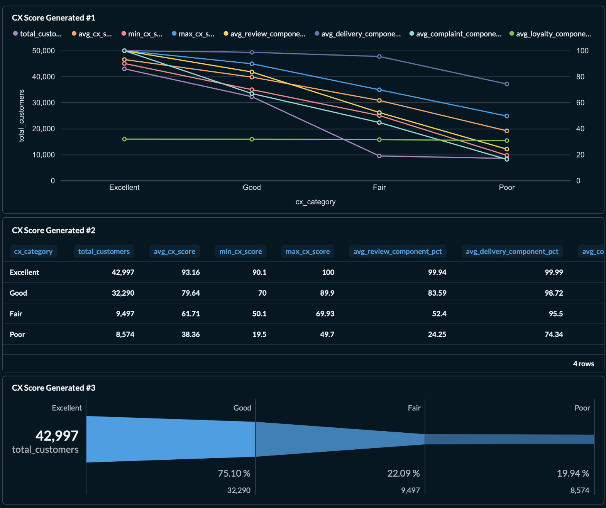

---

**[CX-2] Review Analysis - Distribusi Bintang 1–5**
```sql
SELECT
    ROUND(toFloat64(review_score), 0)               AS star_rating,
    COUNT()                                         AS total_reviews,
    ROUND(COUNT() * 100.0
        / SUM(COUNT()) OVER (), 2)                  AS pct_of_total,
    countIf(complaint_topic = 'delivery')           AS delivery_complaints,
    countIf(complaint_topic = 'damaged_product')    AS damaged_complaints,
    countIf(complaint_topic = 'refund')             AS refund_complaints
FROM analytics.nlp_features
WHERE review_score IS NOT NULL
GROUP BY star_rating
ORDER BY star_rating ASC;
```
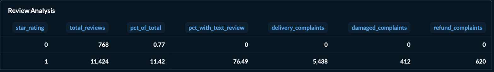


---

**[CX-3] Complaint Analysis — Rate per Segment**
```sql
SELECT
    cx.cx_category,
    COUNT(DISTINCT cx.customer_unique_id)           AS total_customers,
    ROUND(AVG(cx.complaint_rate) * 100, 2)          AS avg_complaint_rate_pct,
    ROUND(AVG(cx.avg_review_score), 2)              AS avg_review_score,
    ROUND(AVG(cx.late_delivery_rate) * 100, 2)      AS avg_late_delivery_pct,
    ROUND(AVG(cx.cx_score), 2)                      AS avg_cx_score,
    ROUND(corr(cx.complaint_rate, cx.cx_score), 4)  AS corr_complaint_vs_cx
FROM analytics.cx_features cx
GROUP BY cx.cx_category
ORDER BY avg_complaint_rate_pct DESC;
```
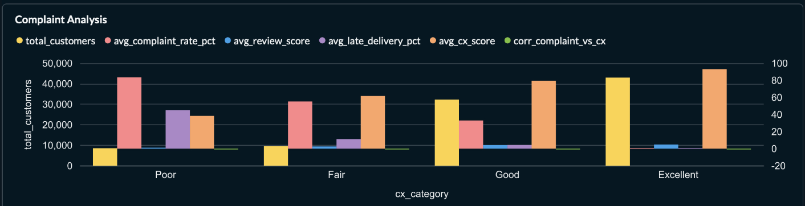

---

**[CX-4] Complaint Topic Classification — 6 Kategori**
```sql
SELECT
    complaint_topic,
    COUNT()                                         AS total_reviews,
    ROUND(COUNT() * 100.0
        / SUM(COUNT()) OVER (), 2)                  AS pct_of_all,
    ROUND(AVG(toFloat64(review_score)), 2)           AS avg_star_rating,
    countIf(toFloat64(review_score) <= 2)           AS low_rating_count,
    ROUND(countIf(toFloat64(review_score) <= 2)
        * 100.0 / COUNT(), 2)                       AS low_rating_pct
FROM analytics.nlp_features
WHERE complaint_topic IS NOT NULL
  AND has_text = 1
GROUP BY complaint_topic
ORDER BY total_reviews DESC;
```


---

**[CX-5] CX Category Segmentation — Proporsi Tier**
```sql
SELECT
    cx_category,
    COUNT(DISTINCT cx.customer_unique_id)           AS total_customers,
    ROUND(COUNT(DISTINCT cx.customer_unique_id)
        * 100.0 / SUM(COUNT(DISTINCT cx.customer_unique_id)) OVER (), 2)
                                                    AS pct_customers,
    ROUND(AVG(cx.cx_score), 2)                      AS avg_cx_score,
    ROUND(AVG(c.monetary), 2)                       AS avg_monetary
FROM analytics.cx_features cx
LEFT JOIN analytics.customer_features c USING (customer_unique_id)
GROUP BY cx_category
ORDER BY avg_cx_score DESC;
```
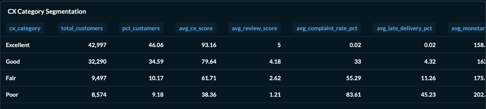

---

## 🔍 8. Customer Behavior Drivers

Halaman ini menganalisis faktor-faktor yang memengaruhi loyalitas dan retensi pelanggan — dari pola keterlambatan pengiriman, metode pembayaran, hingga siklus hidup customer.

> *Screenshot Customer Behavior Drivers dashboard*


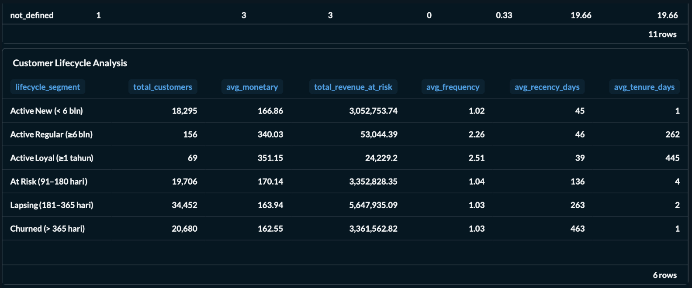

### Query yang Digunakan

**[BHV-1] Delay vs Repeat Analysis**
```sql
SELECT
    CASE
        WHEN toFloat64(delivery_delay_days) < 0    THEN 'Early (sebelum estimasi)'
        WHEN toFloat64(delivery_delay_days) = 0    THEN 'On Time'
        WHEN toFloat64(delivery_delay_days) <= 3   THEN 'Late 1–3 hari'
        WHEN toFloat64(delivery_delay_days) <= 7   THEN 'Late 4–7 hari'
        WHEN toFloat64(delivery_delay_days) <= 14  THEN 'Late 8–14 hari'
        ELSE                                            'Late > 14 hari'
    END                                             AS delay_bucket,
    COUNT(DISTINCT order_id)                        AS total_orders,
    ROUND(AVG(toFloat64(review_score)), 2)          AS avg_review_score,
    ROUND(SUM(repeat_customer) * 100.0
        / COUNT(DISTINCT order_id), 2)              AS repeat_rate_pct,
    ROUND(SUM(cancellation_flag) * 100.0
        / COUNT(DISTINCT order_id), 2)              AS cancellation_rate_pct
FROM analytics.delivery_features
WHERE delivery_delay_days IS NOT NULL
GROUP BY delay_bucket
ORDER BY MIN(toFloat64(delivery_delay_days)) ASC;
```
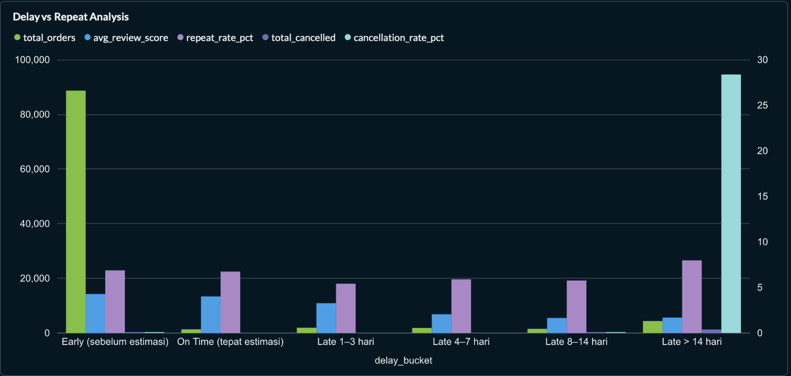

---

**[BHV-2] Payment vs Loyalty Analysis**
```sql
SELECT
    p.payment_type,
    p.installment_group,
    COUNT(DISTINCT p.order_id)                      AS total_orders,
    ROUND(AVG(p.payment_value), 2)                  AS avg_payment_value,
    ROUND(AVG(c.frequency), 2)                      AS avg_frequency,
    ROUND(AVG(c.monetary), 2)                       AS avg_monetary,
    ROUND(SUM(c.repeat_customer) * 100.0
        / COUNT(DISTINCT d.customer_id), 2)         AS repeat_rate_pct
FROM analytics.payment_features p
LEFT JOIN analytics.delivery_features d ON p.order_id = d.order_id
LEFT JOIN analytics.customer_features c ON d.customer_id = c.customer_unique_id
WHERE p.payment_type IS NOT NULL
GROUP BY p.payment_type, p.installment_group
ORDER BY avg_monetary DESC;
```

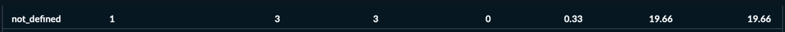

---

**[BHV-3] Customer Lifecycle Analysis**
```sql
SELECT
    CASE
        WHEN recency_days <= 90
             AND customer_tenure_days >= 365  THEN 'Active Loyal (≥1 tahun)'
        WHEN recency_days <= 90
             AND customer_tenure_days >= 180  THEN 'Active Regular (≥6 bln)'
        WHEN recency_days <= 90
             AND customer_tenure_days < 180   THEN 'Active New (< 6 bln)'
        WHEN recency_days BETWEEN 91 AND 180  THEN 'At Risk (91–180 hari)'
        WHEN recency_days BETWEEN 181 AND 365 THEN 'Lapsing (181–365 hari)'
        ELSE                                       'Churned (> 365 hari)'
    END                                             AS lifecycle_segment,
    COUNT(DISTINCT customer_unique_id)              AS total_customers,
    ROUND(AVG(monetary), 2)                         AS avg_monetary,
    ROUND(SUM(monetary), 2)                         AS total_revenue_at_risk,
    ROUND(AVG(frequency), 2)                        AS avg_frequency,
    ROUND(AVG(recency_days), 0)                     AS avg_recency_days
FROM analytics.customer_features
GROUP BY lifecycle_segment
ORDER BY MIN(recency_days) ASC;
```
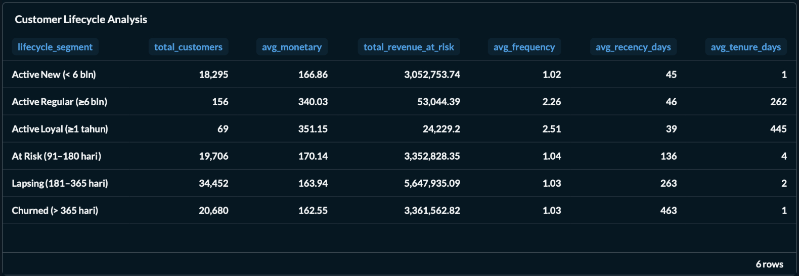

---

## 🗺️ 9. Geo & Seller Analytics

Halaman ini menganalisis distribusi geografis pelanggan dan kinerja seller per region untuk mendukung keputusan ekspansi pasar dan optimalisasi logistik.

> *Screenshot Geo & Seller Analytics dashboard*


### Query yang Digunakan

**[GEO-1] Customer Distribution Map**
```sql
SELECT
    g.customer_state,
    COUNT(DISTINCT g.customer_unique_id)            AS total_customers,
    ROUND(SUM(c.monetary), 2)                       AS total_revenue,
    ROUND(AVG(c.avg_order_value), 2)                AS avg_order_value,
    ROUND(SUM(c.repeat_customer) * 100.0
        / COUNT(DISTINCT g.customer_unique_id), 2)  AS repeat_rate_pct,
    ROUND(AVG(g.geolocation_lat), 4)                AS avg_lat,
    ROUND(AVG(g.geolocation_lng), 4)                AS avg_lng,
    ROUND(SUM(c.monetary)
        / COUNT(DISTINCT g.customer_unique_id), 2)  AS revenue_per_customer
FROM analytics.geo_features g
LEFT JOIN analytics.customer_features c
    ON g.customer_unique_id = c.customer_unique_id
WHERE g.customer_state IS NOT NULL
  AND g.geolocation_lat IS NOT NULL
GROUP BY g.customer_state
ORDER BY total_revenue DESC;
```
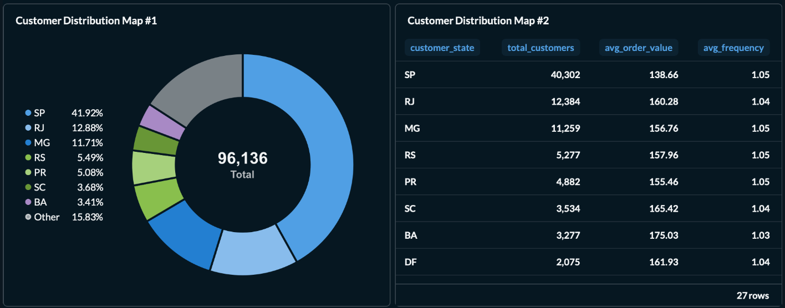
---

**[GEO-2] Revenue by State Analysis**

```sql
SELECT
    g.customer_state,
    COUNT(DISTINCT g.customer_unique_id)            AS total_customers,
    ROUND(SUM(c.monetary), 2)                       AS total_revenue,
    ROUND(SUM(c.monetary) * 100.0
        / SUM(SUM(c.monetary)) OVER (), 2)          AS pct_of_total_revenue,
    COUNT(DISTINCT s.order_id)                      AS orders_with_seller_data,
    ROUND(AVG(toFloat64(s.same_state)) * 100, 2)    AS intrastate_order_pct,
    ROUND(AVG(s.freight_ratio), 4)                  AS avg_freight_ratio,
    ROUND(AVG(s.freight_value), 2)                  AS avg_freight_value
FROM analytics.geo_features g
LEFT JOIN analytics.customer_features c
    ON g.customer_unique_id = c.customer_unique_id
LEFT JOIN analytics.delivery_features d
    ON d.customer_id = g.customer_unique_id
LEFT JOIN analytics.seller_features s
    ON s.order_id = d.order_id
WHERE g.customer_state IS NOT NULL
GROUP BY g.customer_state
ORDER BY total_revenue DESC
LIMIT 20;
```
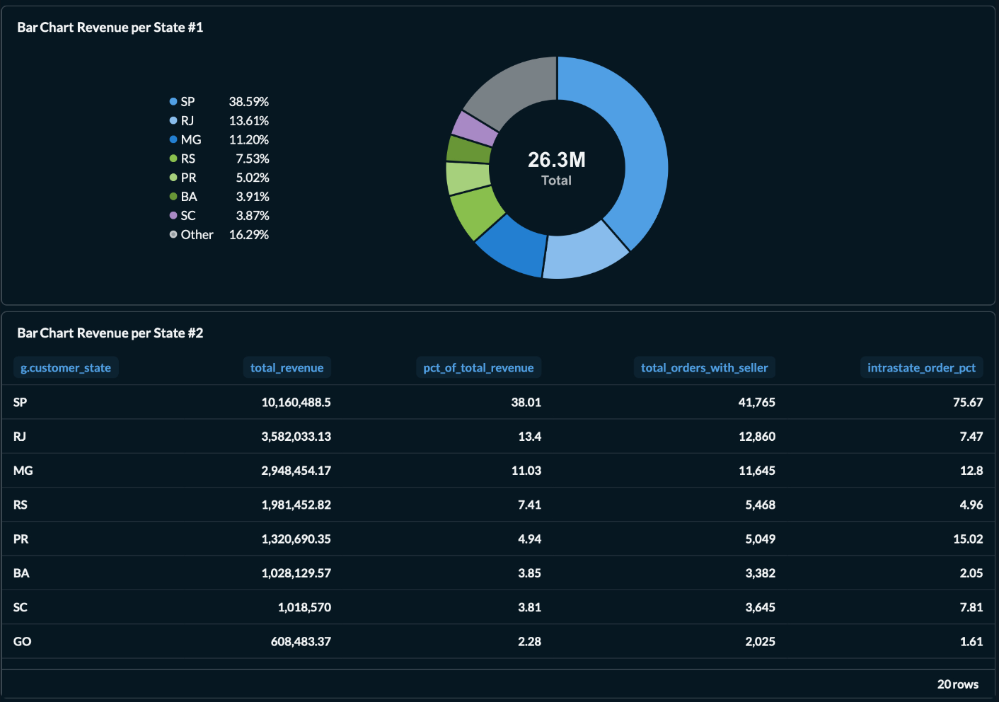
---

## 10. NLP: Keyword Extraction & Sentiment Score *(Coming Soon)*

> ⚠️ **Fitur ini masih dalam progress pengembangan.**

Rencana implementasi menggunakan:

| Model | Fungsi |
|---|---|
| **DistilBERT** (multilingual) | Sentiment classification dari teks ulasan |
| **KeyBERT** | Keyword extraction dari review text |

Output yang akan dihasilkan:

- `sentiment_label` — Positive / Neutral / Negative per review
- `sentiment_score` — confidence score 0.0–1.0
- `top_keywords` — keyword utama per review

Arsitektur yang direncanakan:

```
Airflow DAG
    ├── [1] Preprocessing teks (existing nlp_features)
    ├── [2] NLP Inference — DistilBERT + KeyBERT (batch mode)
    │         └── simpan hasil ke data_lake/features/nlp_sentiment
    └── [3] Load ke ClickHouse → nlp_sentiment table
                  └── Visualisasi di Metabase
```

Dashboard Power BI juga direncanakan sebagai **alternatif visualisasi** di samping Metabase untuk kebutuhan presentasi yang lebih formal.

---

## 11. Insight & Strategi Bisnis

Insight disusun dalam 5 area utama: Customer Base & Revenue, Complaint & CX Score, Delivery & Retensi, Segmentasi & Lifecycle, dan Geo & Seller, masing-masing disertai strategi konkret yang dapat diimplementasikan sebagai langkah lanjutan.

### 11.1 Customer Base & Revenue

- Total **93,358 unique customers** dengan distribusi mayoritas adalah **one-time buyer** (repeat rate rendah)
- Revenue sangat terkonsentrasi: **state SP (São Paulo)** mendominasi baik dari sisi jumlah customer maupun total revenue
- Pelanggan dengan `monetary > P75` dan `repeat_customer = 1` menjadi segmen **Champion** yang perlu dipertahankan dengan program loyalitas

**Strategi:** Fokus retention program ke segment Champion dan Loyal yang sudah ada. Acquisition biaya lebih tinggi dari retention — prioritaskan upsell ke existing customer.

---

### 11.2 Complaint & CX Score

- Topik complaint terbesar adalah **delivery** (~17K ulasan), diikuti `seller_communication` (~978) dan `packaging` (~538)
- Review **bintang 1** memiliki korelasi kuat dengan complaint topik `refund` dan `damaged_product`
- Customer di tier CX **Poor** memiliki `complaint_rate` tertinggi namun juga berpotensi menjadi segment yang perlu diprioritaskan untuk recovery

**Strategi:** Perbaikan pengiriman adalah intervensi dengan impact terbesar. Implementasi SLA tracking dan notifikasi proaktif ke customer ketika order terlambat dapat mengurangi complaint volume secara signifikan.

---

### 11.3 Delivery & Retensi

- Customer yang menerima pengiriman **lebih cepat dari estimasi** memiliki `repeat_rate` dan `review_score` lebih tinggi
- Keterlambatan `> 7 hari` berkorelasi dengan penurunan review score dan repeat rate yang drastis
- Cancellation rate meningkat signifikan pada order dengan `delivery_delay_days > 14`

**Strategi:** Optimalkan estimasi pengiriman — lebih baik memberikan estimasi konservatif (lebih lama) namun konsisten terpenuhi, daripada estimasi optimis namun sering miss.

---

### 11.4 Segmentasi & Lifecycle

- Mayoritas pelanggan berada di segment **"Churned"** dan **"One-Time Inactive"** — ini adalah peluang win-back campaign
- Pelanggan **Active Loyal** memiliki `avg_monetary` dan `avg_frequency` tertinggi secara konsisten
- Segment **"At Risk"** (recency 91–180 hari) adalah prioritas intervensi sebelum menjadi Churned

**Strategi:**
- **Active Loyal** → VIP program, early access, exclusive offer
- **At Risk** → Re-engagement campaign dengan personalized offer berdasarkan `preferred_payment_type`
- **Churned** → Win-back email dengan diskon berbasis produk yang pernah dibeli

---

### 11.5 Geo & Seller

- **SP, RJ, MG** adalah 3 state dengan revenue tertinggi — namun `avg_freight_ratio` di state-state ini relatif lebih tinggi
- State dengan `intrastate_order_pct` rendah (customer dan seller dari state berbeda) cenderung memiliki freight cost lebih tinggi dan delivery lebih lambat
- Seller di state dengan `high_freight_flag` tinggi berpotensi menjadi bottleneck kepuasan pelanggan

**Strategi:** Prioritaskan rekrutmen seller lokal di state-state dengan `intrastate_order_pct` rendah untuk mengurangi freight cost dan mempercepat delivery time.

---

## 🏁 12. Penutup

Platform ini berhasil mengimplementasikan arsitektur **Big Data end-to-end** yang mencakup:

- **Automated ingestion** dari Google Drive -> Data Lake
- **Scalable processing** dengan Apache Spark untuk 6 feature tables
- **Full orchestration** via Apache Airflow DAG
- **OLAP warehouse** di ClickHouse dengan 7 analytics tables
- **Interactive dashboard** di Metabase dengan query spesifik per KPI
- **Regex-based NLP** untuk complaint topic classification (6 kategori)
- **CX Score** composite metric yang menggabungkan 4 dimensi pengalaman pelanggan
- **NLP Sentiment** dengan DistilBERT + KeyBERT *(in progress)*

---

<div align="center">

**Institut Teknologi Sepuluh Nopember**
<br>
Departemen Informatika — 2025/2026
<br><br>

| Nama | NRP |
|---|---|
| **Ibrahim Ferel** | 5025241049 |

<br>

*Manajemen Cerdas Informasi*

</div>