<div align="center">

# Project PULSE: Platform for Unified Customer Analytics and Business Intelligence


**End-to-end Customer Analytics Platform** untuk menganalisis performa pelanggan, pengalaman transaksi, dan segmentasi customer dari dataset e-commerce Brazil (Olist)

</div>

---

## Table of Contents

1. [Perkenalan](#-1-perkenalan)
2. [Key Performance Index](#-2-key-performance-index)
3. [Data Engineering Pipeline](#-3-data-engineering-pipeline)
4. [Overview Dashboard Analytics](#-4-overview-dashboard-analytics)
5. [Customer Performance Overview](#-5-customer-performance-overview)
6. [Customer Segmentation](#-6-customer-segmentation)
7. [Customer Experience Analytics](#-7-customer-experience-analytics)
8. [Customer Behavior Drivers](#-8-customer-behavior-drivers)
9. [Geo & Seller Analytics](#-9-geo--seller-analytics)
10. [NLP: Keyword Extraction & Sentiment Score](#-10-nlp-keyword-extraction--sentiment-score-coming-soon)
11. [Insight & Strategi Bisnis](#-11-insight--strategi-bisnis)
12. [Executive Summary](#-12-executive-summary)
13. [Challenges & Limitations](#-13-challenges--limitations)
14. [Penutup](#-14-penutup)

---

## 1. Perkenalan

<table align="center">
  <tr>
    <td align="center" width="320">
      <br><br>
      <b>Ibrahim Ferel</b><br>
      <code>5025241049</code>
    </td>
  </tr>
</table>

### Tentang Project

**DustiniaDelixia Customer Performance Analytics Platform** adalah pipeline data end-to-end yang dibangun untuk menganalisis perilaku, performa, dan pengalaman pelanggan secara komprehensif menggunakan dataset e-commerce Brazil dari Olist yang diberikan oleh para **Admin Manajemen Cerdas Informasi.**

Platform ini menjawab pertanyaan bisnis kritis seperti:

- Siapa pelanggan paling berharga dan paling loyal?
- Apa faktor utama yang memengaruhi kepuasan dan pengalaman pelanggan (CX Score)?
- Di mana distribusi pelanggan dan revenue terkonsentrasi secara geografis?
- Topik komplain apa yang paling sering muncul, dan bagaimana pengaruhnya terhadap rating?

### Stack Teknologi

| Layer | Teknologi | Fungsi |
|---|---|---|
| Ingestion | Python + Pandas | Fetch dataset CSV -> Parquet |
| Processing | Apache Spark (PySpark) | Feature engineering skala besar |
| Orchestration | Apache Airflow | DAG scheduling & monitoring |
| Warehouse | ClickHouse | OLAP storage & query engine |
| Visualization | Metabase | Interactive dashboard |
| NLP | DistilBERT + KeyBERT | Sentiment & keyword extraction |
| Infrastructure | Docker Compose | Containerized deployment (Penyesuaian Settingan Docker dengan Modul Hands On) |

### Dataset

Dataset yang digunakan adalah **Olist Brazil E-Commerce Dataset** dengan 7 file CSV:

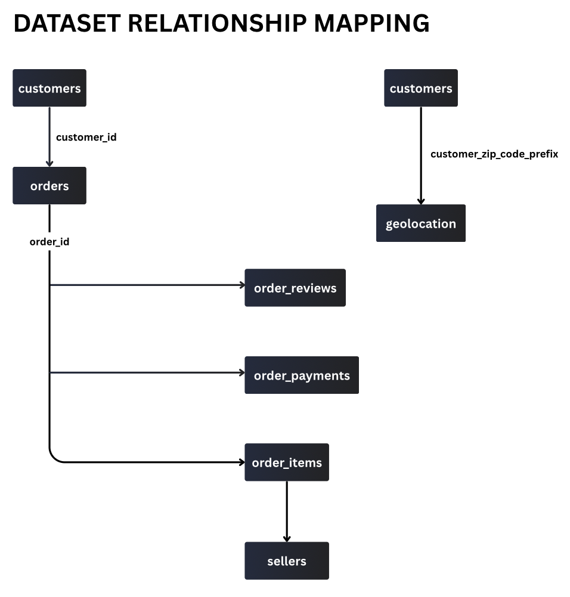

1. orders.csv          
2. order_items.csv     
3. order_payments.csv
4. order_reviews.csv   
5. customers.csv       
6. sellers.csv
7. geolocation.csv

---

## 2. Key Performance Index

KPI project ini dibagi ke dalam **6 Program Kerja** dengan total bobot program = 1.0.

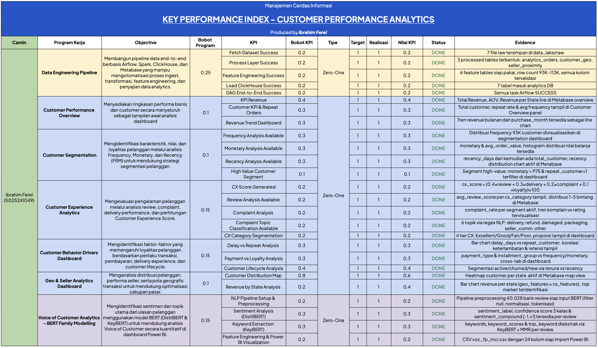

### Rekap KPI

| Program Kerja | Bobot | Status |
|---|---|---|
| Data Engineering Pipeline |0.25| Done |
| Customer Performance Overview |0.1| Done |
| Customer Segmentation |0.1| Done |
| Customer Experience Analytics |0.15| Done |
| Customer Behavior Drivers Dashboard |0.15| Done |
| Geo & Seller Analytics Dashboard |0.1| Done |
| NLP: Keyword Extraction & Sentiment Score |0.15| Done |

---

## 3. Data Engineering Pipeline

### Arsitektur Pipeline


Source: https://canva.link/w7njlxzh9dh1fxc

### DAG Orchestration

File: `dustiniadelixia_pipeline.py`

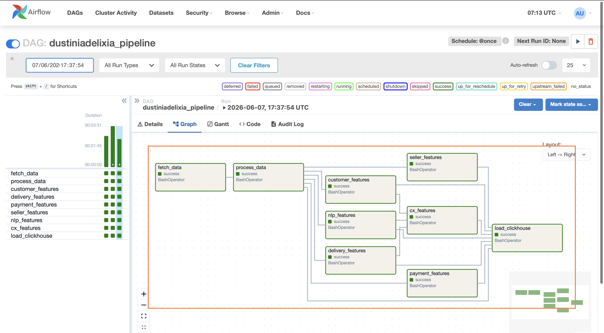

```
fetch_data >> process_data

    process_data >> [
        customer_features,
        delivery_features,
        payment_features,
        seller_features,
        nlp_features
    ]

    [
        customer_features,
        delivery_features,
        nlp_features
    ] >> cx_features

    [
        customer_features,
        delivery_features,
        payment_features,
        seller_features,
        nlp_features,
        cx_features,
        process_data
    ] >> load_clickhouse
```

Seluruh feature engineering berjalan **paralel** setelah `process_data` selesai, kemudian `cx_features` dan `load_clickhouse` menunggu semua upstream task sukses.

---

### Layer 1: Fetch Layer

**Script:** `fetch_dustiniadelixia_data.py`

Mengambil dataset ZIP dari Google Drive, mengekstrak CSV, dan mengkonversi ke Parquet. Sebelum masuk ke tahap orkestrasi, saya coba jalankan di local terlebih dahulu.

```
ZIP -> Extract -> CSV -> Parquet -> data_lake/raw/
```

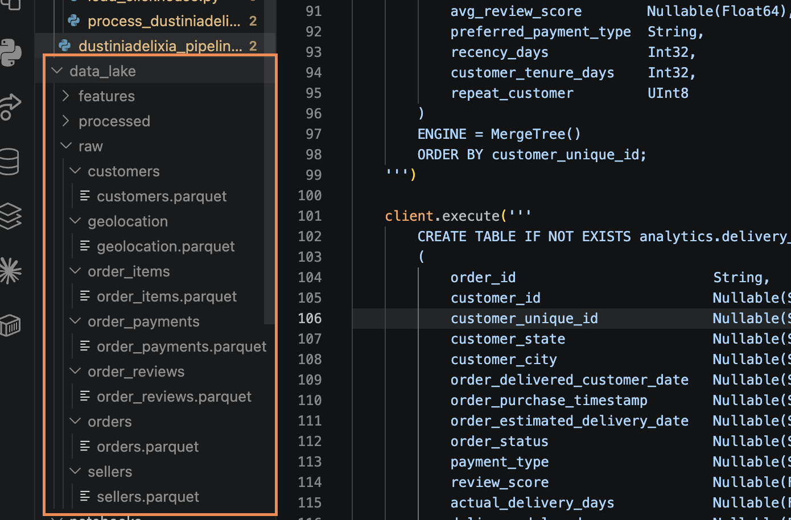

**Output struktur:**

```
raw/
├── orders/orders.parquet
├── order_items/order_items.parquet
├── customers/customers.parquet
├── sellers/sellers.parquet
├── geolocation/geolocation.parquet
├── order_reviews/order_reviews.parquet
└── order_payments/order_payments.parquet
```

---

### Layer 2: Processing Layer

**Script:** `process_dustiniadelixia_spark.py`

Melakukan join antar tabel raw untuk menghasilkan 3 denormalized tables yang digunakan oleh semua feature engineering scripts.

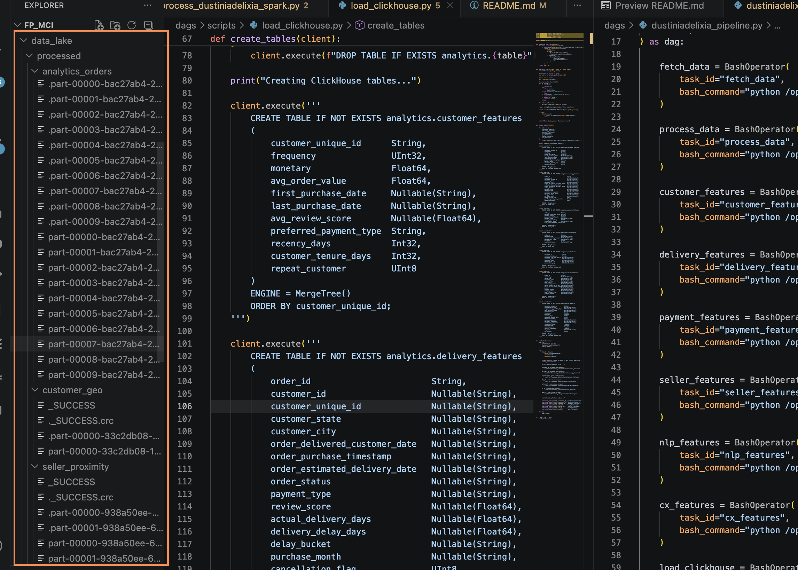

| Output Table | Join Sources | Digunakan Oleh |
|---|---|---|
| `analytics_orders` | orders + items + payments + reviews + customers | Customer, Delivery, Payment, NLP, CX FE |
| `customer_geo` | customers + geolocation | Geo Analytics |
| `seller_proximity` | orders + items + customers + sellers | Seller-Customer Analytics |

---

### Layer 3: Feature Engineering


6 script FE berjalan paralel, masing-masing menghasilkan 1 feature table:

| Script | Output Table | Row Count | Key Features |
|---|---|---|---|
| `fe_customer.py` | `customer_features` | 93,358 | frequency, monetary, recency_days, tenure_days, repeat_customer |
| `fe_delivery.py` | `delivery_features` | 99,992 | actual_delivery_days, delivery_delay_days, delay_bucket, cancellation_flag |
| `fe_payment.py` | `payment_features` | 99,440 | payment_type, installment_group, multi_payment_flag, high_value_flag |
| `fe_seller.py` | `seller_features` | 113,425 | same_state, freight_ratio, interstate_order, high_freight_flag |
| `fe_nlp.py` | `nlp_features` | 99,992 | complaint_topic, review_text_clean, has_text |
| `fe_cx.py` | `cx_features` | 93,358 | cx_score, cx_category, loyalty_component, semua sub-score |

---

### CX Score Formula

```
cx_score = (
    review_component    × 0.4  +
    delivery_component  × 0.3  +
    complaint_component × 0.2  +
    loyalty_component   × 0.1
) × 100
```

**Loyalty Component** adalah composite dari 3 sub-score:

```
loyalty_component = frequency_score × 0.5
                  + tenure_score    × 0.3
                  + recency_score   × 0.2
```

| Komponen | Skala | Threshold |
|---|---|---|
| `review_component` | 0.0–1.0 | `avg_review_score / 5.0` |
| `delivery_component` | 0.3–1.0 | ≤0 hari=1.0, ≤3=0.8, ≤7=0.6, else=0.3 |
| `complaint_component` | 0.0–1.0 | `1 - complaint_rate` |
| `frequency_score` | 0.2–1.0 | freq≥5=1.0, 4=0.8, 3=0.6, 2=0.4, else=0.2 |
| `tenure_score` | 0.2–1.0 | ≥365d=1.0, ≥180=0.8, ≥90=0.6, ≥30=0.4, else=0.2 |
| `recency_score` | 0.2–1.0 | ≤30d=1.0, ≤90=0.8, ≤180=0.6, ≤365=0.4, else=0.2 |

**CX Category:**

```
Excellent : cx_score ≥ 90
Good      : cx_score ≥ 70
Fair      : cx_score ≥ 50
Poor      : cx_score < 50
```

---

### NLP: Complaint Topic Classification

Complaint topic diklasifikasikan menggunakan **regex-based NLP** dari teks ulasan pelanggan (Bahasa Portugis):

| Topik | Regex Keywords | Count |
|---|---|---|
| `delivery` | entrega, atraso, prazo, recebi, correio, rastreio, ... | ~17,128 |
| `seller_communication` | vendedor, atendimento, suporte, resposta, contato, ... | ~978 |
| `packaging` | embalagem, caixa, pacote, embalado, rasgada, ... | ~538 |
| `damaged_product` | defeito, quebrado, danificado, avariado, falha, ... | ~440 |
| `refund` | devolver, estorno, reembolso, cancelar, troca, ... | ~270 |
| `other` | *(semua yang tidak match regex di atas)* | ~80,638 |

---

### Proof: Airflow DAG Success

*Screenshot DAG Airflow semua task SUCCESS:*


---

### Proof: ClickHouse Data Verified

```sql
SELECT 'customer_features'  AS table_name, count() AS rows FROM analytics.customer_features
UNION ALL SELECT 'delivery_features',  count() FROM analytics.delivery_features
UNION ALL SELECT 'payment_features',   count() FROM analytics.payment_features
UNION ALL SELECT 'nlp_features',       count() FROM analytics.nlp_features
UNION ALL SELECT 'seller_features',    count() FROM analytics.seller_features
UNION ALL SELECT 'cx_features',        count() FROM analytics.cx_features
UNION ALL SELECT 'geo_features',       count() FROM analytics.geo_features
ORDER BY rows DESC;
```

*Screenshot hasil query ClickHouse:*


---

## 4. Overview Dashboard Analytics

Dashboard Metabase dibagi ke dalam **5 halaman utama**, masing-masing memetakan langsung ke program kerja KPI.

| Halaman | Sumber Data | Jumlah Chart |
|---|---|---|
| Customer Performance Overview | `customer_features`, `delivery_features` | 3 |
| Customer Segmentation | `customer_features` | 4 |
| Customer Experience Analytics | `cx_features`, `nlp_features` | 5 |
| Customer Behavior Drivers | `delivery_features`, `payment_features`, `customer_features` | 3 |
| Geo & Seller Analytics | `geo_features`, `customer_features`, `seller_features` | 2 |

---

## 5. Customer Performance Overview

Halaman ini menyajikan ringkasan KPI bisnis tingkat atas: revenue, customer base, dan tren waktu sebagai entry point analisis.

*Screenshot Customer Performance Overview dashboard*


### Query yang Digunakan

**[CPO-1] KPI Revenue - Total Revenue, AOV, Total Customers**
```sql
SELECT
    ROUND(SUM(monetary), 2)                         AS total_revenue,
    ROUND(AVG(avg_order_value), 2)                  AS avg_order_value,
    COUNT(DISTINCT customer_unique_id)               AS total_customers,
    ROUND(SUM(monetary)
        / COUNT(DISTINCT customer_unique_id), 2)    AS revenue_per_customer
FROM analytics.customer_features;
```
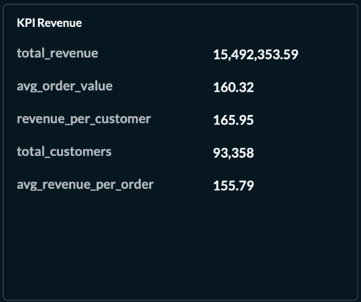

---

**[CPO-2] Customer KPI & Repeat Orders**
```sql
SELECT
    COUNT(DISTINCT customer_unique_id)              AS total_customers,
    SUM(repeat_customer)                            AS total_repeat_customers,
    ROUND(SUM(repeat_customer) * 100.0
        / COUNT(DISTINCT customer_unique_id), 2)    AS repeat_rate_pct,
    ROUND(AVG(frequency), 2)                        AS avg_frequency,
    ROUND(AVG(monetary), 2)                         AS avg_monetary
FROM analytics.customer_features;
```
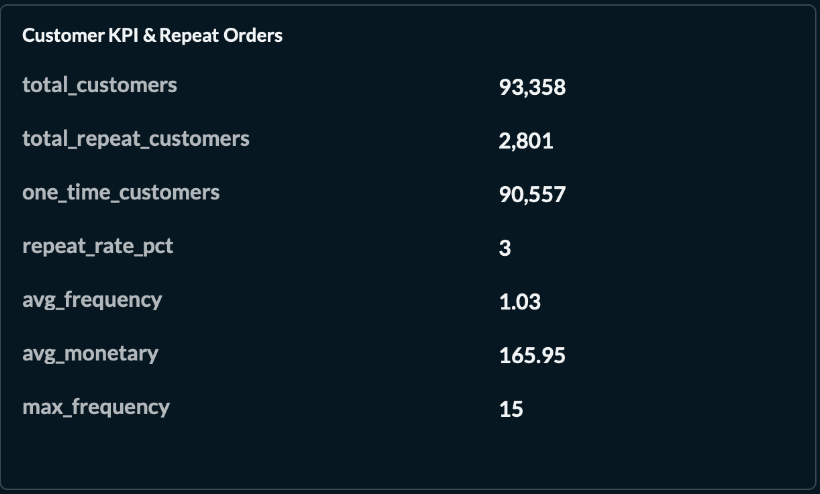

---

**[CPO-3] Revenue Trend Dashboard - Line Chart Bulanan**
```sql
SELECT
    d.purchase_month,
    COUNT(DISTINCT d.order_id)                      AS total_orders,
    COUNT(DISTINCT d.customer_id)                   AS unique_customers,
    ROUND(AVG(toFloat64(d.review_score)), 2)        AS avg_review_score,
    SUM(d.cancellation_flag)                        AS cancelled_orders,
    ROUND(SUM(d.cancellation_flag) * 100.0
        / COUNT(DISTINCT d.order_id), 2)            AS cancellation_rate_pct
FROM analytics.delivery_features d
WHERE d.purchase_month IS NOT NULL
GROUP BY d.purchase_month
ORDER BY d.purchase_month ASC;
```
-

---

## 6. Customer Segmentation

Halaman ini menganalisis karakteristik pelanggan melalui dimensi **Frequency**, **Monetary**, dan **Recency** (FRM) untuk mendukung strategi segmentasi yang tepat sasaran.

*Screenshot Customer Segmentation dashboard*

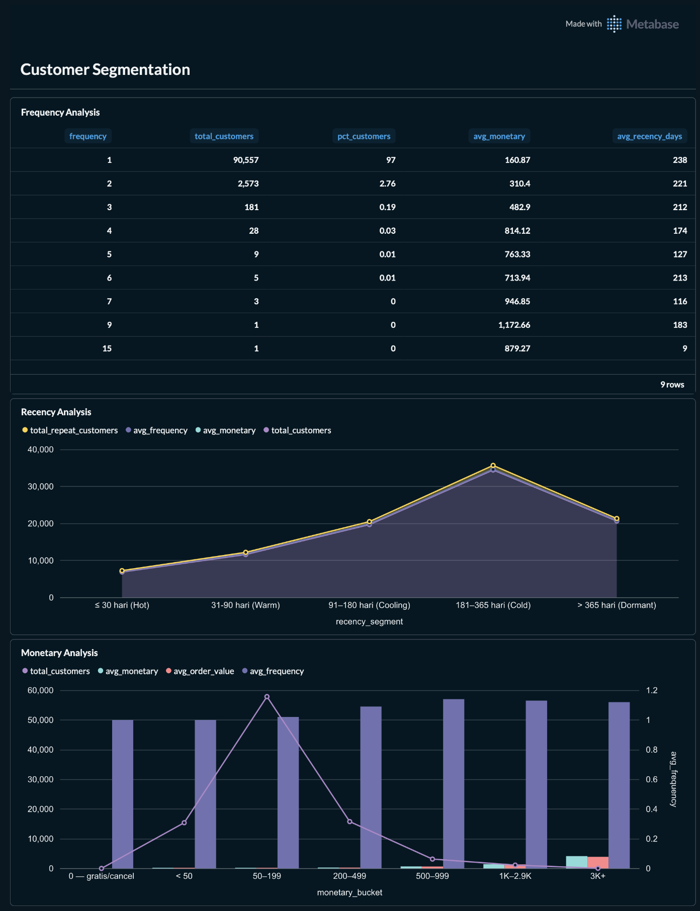
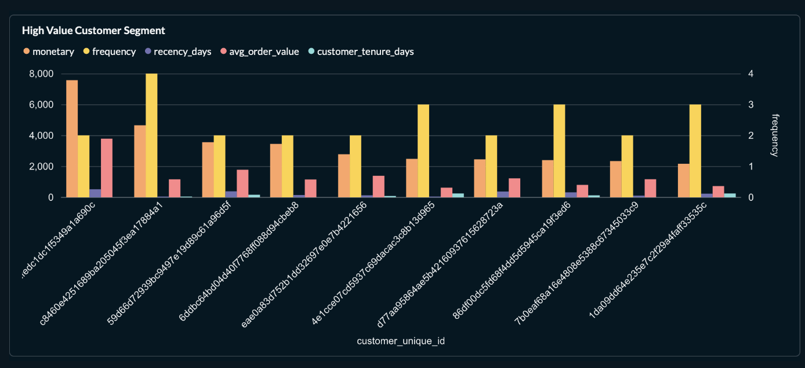
 
### Query yang Digunakan

**[SEG-1] Frequency Distribution**
```sql
SELECT
    frequency,
    COUNT(DISTINCT customer_unique_id)              AS total_customers,
    ROUND(COUNT(DISTINCT customer_unique_id) * 100.0
        / SUM(COUNT(DISTINCT customer_unique_id)) OVER (), 2)
                                                    AS pct_customers,
    ROUND(AVG(monetary), 2)                         AS avg_monetary
FROM analytics.customer_features
GROUP BY frequency
ORDER BY frequency ASC;
```


---

**[SEG-2] Monetary Distribution (Bucket)**
```sql
SELECT
    CASE
        WHEN monetary < 50    THEN '< 50'
        WHEN monetary < 200   THEN '50–199'
        WHEN monetary < 500   THEN '200–499'
        WHEN monetary < 1000  THEN '500–999'
        WHEN monetary < 3000  THEN '1K–2.9K'
        ELSE                       '3K+'
    END                                             AS monetary_bucket,
    COUNT(DISTINCT customer_unique_id)              AS total_customers,
    ROUND(AVG(monetary), 2)                         AS avg_monetary,
    ROUND(AVG(avg_order_value), 2)                  AS avg_order_value
FROM analytics.customer_features
GROUP BY monetary_bucket
ORDER BY MIN(monetary) ASC;
```


---

**[SEG-3] Recency Distribution**
```sql
SELECT
    CASE
        WHEN recency_days <= 30   THEN '≤ 30 hari (Hot)'
        WHEN recency_days <= 90   THEN '31–90 hari (Warm)'
        WHEN recency_days <= 180  THEN '91–180 hari (Cooling)'
        WHEN recency_days <= 365  THEN '181–365 hari (Cold)'
        ELSE                           '> 365 hari (Dormant)'
    END                                             AS recency_segment,
    COUNT(DISTINCT customer_unique_id)              AS total_customers,
    ROUND(AVG(monetary), 2)                         AS avg_monetary,
    ROUND(AVG(frequency), 2)                        AS avg_frequency
FROM analytics.customer_features
GROUP BY recency_segment
ORDER BY MIN(recency_days) ASC;
```
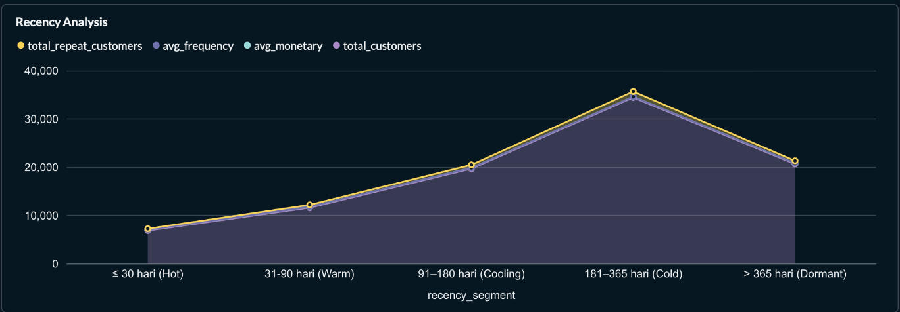

---

**[SEG-4] High Value Customer Segmentation**
```sql
SELECT
    customer_unique_id,
    frequency,
    ROUND(monetary, 2)                              AS monetary,
    ROUND(avg_order_value, 2)                       AS avg_order_value,
    recency_days,
    customer_tenure_days,
    preferred_payment_type,
    CASE
        WHEN monetary >= (SELECT quantile(0.95)(monetary)
                          FROM analytics.customer_features)
             THEN 'Top 5%'
        WHEN monetary >= (SELECT quantile(0.90)(monetary)
                          FROM analytics.customer_features)
             THEN 'Top 10%'
        ELSE 'Top 25%'
    END                                             AS value_tier
FROM analytics.customer_features
WHERE repeat_customer = 1
  AND monetary >= (
      SELECT quantile(0.75)(monetary)
      FROM analytics.customer_features
  )
ORDER BY monetary DESC
LIMIT 200;
```
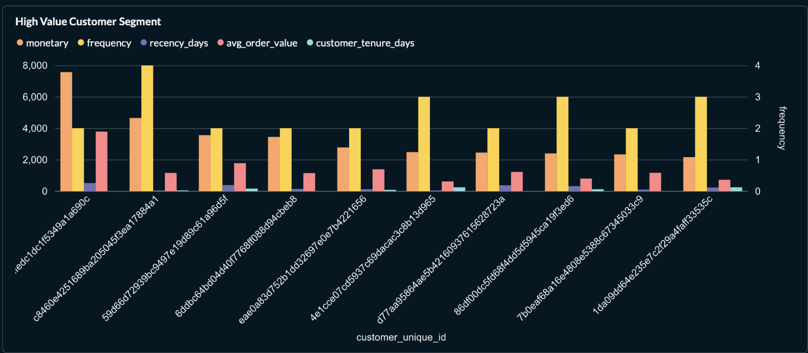

---

## 7. Customer Experience Analytics

Halaman ini mengevaluasi pengalaman pelanggan melalui empat dimensi: review score, complaint rate, delivery performance, dan loyalty, dikombinasikan menjadi satu **CX Score (0–100)**.

*Screenshot Customer Experience Analytics dashboard*


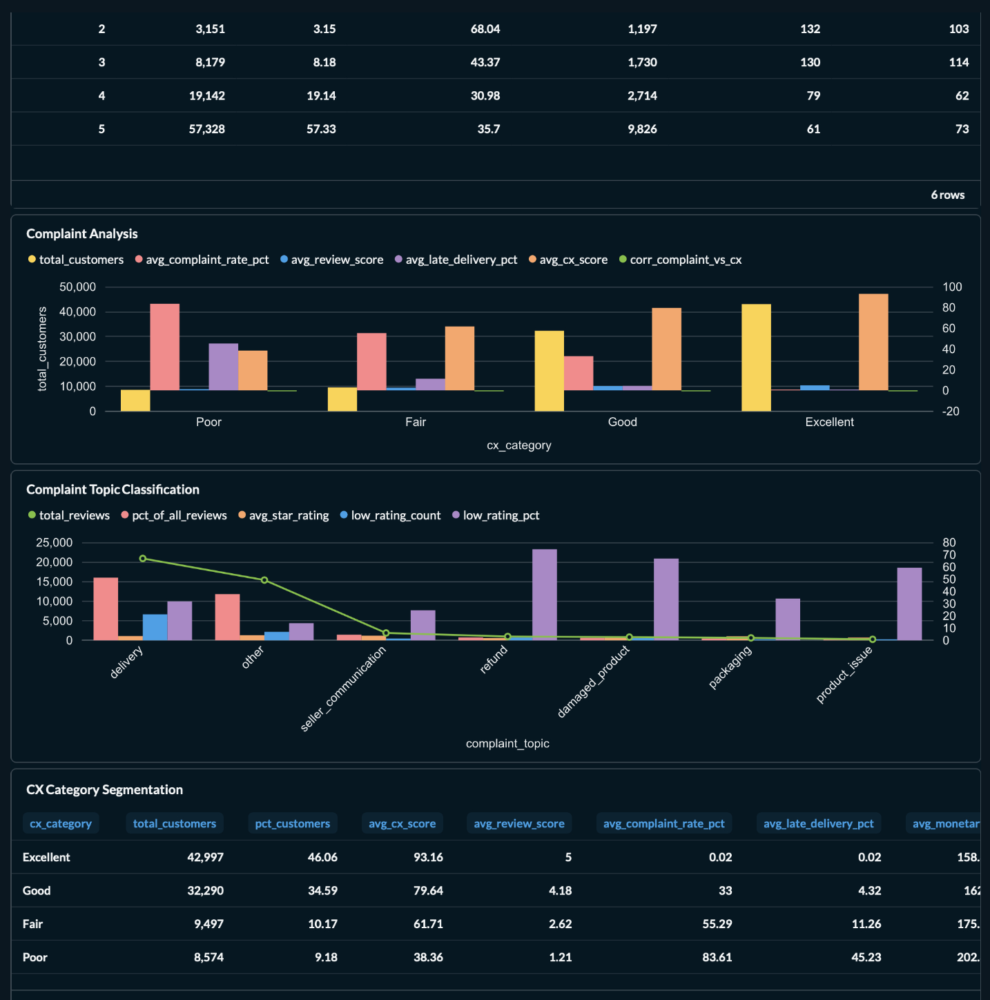

### Query yang Digunakan

**[CX-1] CX Score Generated**
```sql
SELECT
    cx_category,
    COUNT(DISTINCT customer_unique_id)              AS total_customers,
    ROUND(AVG(cx_score), 2)                         AS avg_cx_score,
    ROUND(MIN(cx_score), 2)                         AS min_cx_score,
    ROUND(MAX(cx_score), 2)                         AS max_cx_score,
    ROUND(AVG(review_component) * 100, 2)           AS avg_review_pct,
    ROUND(AVG(delivery_component) * 100, 2)         AS avg_delivery_pct,
    ROUND(AVG(complaint_component) * 100, 2)        AS avg_complaint_pct,
    ROUND(AVG(loyalty_component) * 100, 2)          AS avg_loyalty_pct
FROM analytics.cx_features
GROUP BY cx_category
ORDER BY avg_cx_score DESC;
```


---

**[CX-2] Review Analysis - Distribusi Bintang 1–5**
```sql
SELECT
    ROUND(toFloat64(review_score), 0)               AS star_rating,
    COUNT()                                         AS total_reviews,
    ROUND(COUNT() * 100.0
        / SUM(COUNT()) OVER (), 2)                  AS pct_of_total,
    countIf(complaint_topic = 'delivery')           AS delivery_complaints,
    countIf(complaint_topic = 'damaged_product')    AS damaged_complaints,
    countIf(complaint_topic = 'refund')             AS refund_complaints
FROM analytics.nlp_features
WHERE review_score IS NOT NULL
GROUP BY star_rating
ORDER BY star_rating ASC;
```

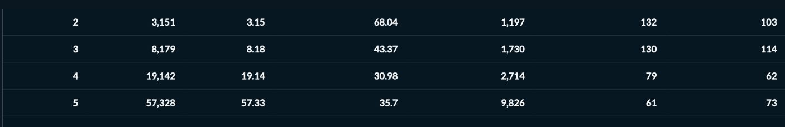

---

**[CX-3] Complaint Analysis, Rate per Segment**
```sql
SELECT
    cx.cx_category,
    COUNT(DISTINCT cx.customer_unique_id)           AS total_customers,
    ROUND(AVG(cx.complaint_rate) * 100, 2)          AS avg_complaint_rate_pct,
    ROUND(AVG(cx.avg_review_score), 2)              AS avg_review_score,
    ROUND(AVG(cx.late_delivery_rate) * 100, 2)      AS avg_late_delivery_pct,
    ROUND(AVG(cx.cx_score), 2)                      AS avg_cx_score,
    ROUND(corr(cx.complaint_rate, cx.cx_score), 4)  AS corr_complaint_vs_cx
FROM analytics.cx_features cx
GROUP BY cx.cx_category
ORDER BY avg_complaint_rate_pct DESC;
```


---

**[CX-4] Complaint Topic Classification, 6 Kategori**
```sql
SELECT
    complaint_topic,
    COUNT()                                         AS total_reviews,
    ROUND(COUNT() * 100.0
        / SUM(COUNT()) OVER (), 2)                  AS pct_of_all,
    ROUND(AVG(toFloat64(review_score)), 2)           AS avg_star_rating,
    countIf(toFloat64(review_score) <= 2)           AS low_rating_count,
    ROUND(countIf(toFloat64(review_score) <= 2)
        * 100.0 / COUNT(), 2)                       AS low_rating_pct
FROM analytics.nlp_features
WHERE complaint_topic IS NOT NULL
  AND has_text = 1
GROUP BY complaint_topic
ORDER BY total_reviews DESC;
```
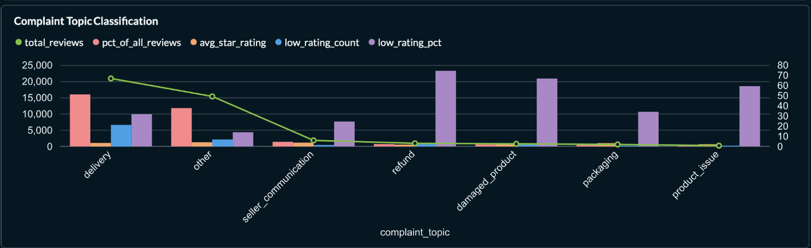

---

**[CX-5] CX Category Segmentation, Proporsi Tier**
```sql
SELECT
    cx_category,
    COUNT(DISTINCT cx.customer_unique_id)           AS total_customers,
    ROUND(COUNT(DISTINCT cx.customer_unique_id)
        * 100.0 / SUM(COUNT(DISTINCT cx.customer_unique_id)) OVER (), 2)
                                                    AS pct_customers,
    ROUND(AVG(cx.cx_score), 2)                      AS avg_cx_score,
    ROUND(AVG(c.monetary), 2)                       AS avg_monetary
FROM analytics.cx_features cx
LEFT JOIN analytics.customer_features c USING (customer_unique_id)
GROUP BY cx_category
ORDER BY avg_cx_score DESC;
```


---

## 8. Customer Behavior Drivers

Halaman ini menganalisis faktor-faktor yang memengaruhi loyalitas dan retensi pelanggan, dari pola keterlambatan pengiriman, metode pembayaran, hingga siklus hidup customer.

*Screenshot Customer Behavior Drivers dashboard*

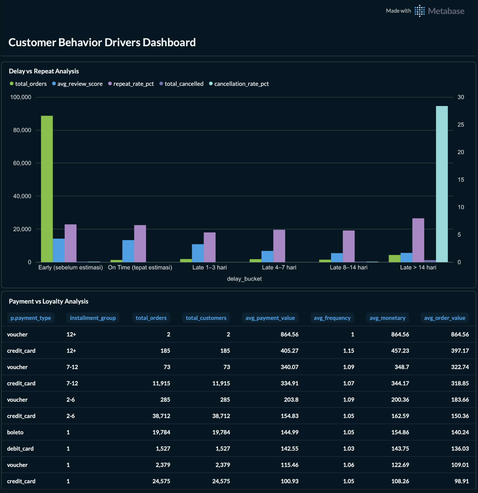


### Query yang Digunakan

**[BHV-1] Delay vs Repeat Analysis**
```sql
SELECT
    CASE
        WHEN toFloat64(delivery_delay_days) < 0    THEN 'Early (sebelum estimasi)'
        WHEN toFloat64(delivery_delay_days) = 0    THEN 'On Time'
        WHEN toFloat64(delivery_delay_days) <= 3   THEN 'Late 1–3 hari'
        WHEN toFloat64(delivery_delay_days) <= 7   THEN 'Late 4–7 hari'
        WHEN toFloat64(delivery_delay_days) <= 14  THEN 'Late 8–14 hari'
        ELSE                                            'Late > 14 hari'
    END                                             AS delay_bucket,
    COUNT(DISTINCT order_id)                        AS total_orders,
    ROUND(AVG(toFloat64(review_score)), 2)          AS avg_review_score,
    ROUND(SUM(repeat_customer) * 100.0
        / COUNT(DISTINCT order_id), 2)              AS repeat_rate_pct,
    ROUND(SUM(cancellation_flag) * 100.0
        / COUNT(DISTINCT order_id), 2)              AS cancellation_rate_pct
FROM analytics.delivery_features
WHERE delivery_delay_days IS NOT NULL
GROUP BY delay_bucket
ORDER BY MIN(toFloat64(delivery_delay_days)) ASC;
```


---

**[BHV-2] Payment vs Loyalty Analysis**
```sql
SELECT
    p.payment_type,
    p.installment_group,
    COUNT(DISTINCT p.order_id)                      AS total_orders,
    ROUND(AVG(p.payment_value), 2)                  AS avg_payment_value,
    ROUND(AVG(c.frequency), 2)                      AS avg_frequency,
    ROUND(AVG(c.monetary), 2)                       AS avg_monetary,
    ROUND(SUM(c.repeat_customer) * 100.0
        / COUNT(DISTINCT d.customer_id), 2)         AS repeat_rate_pct
FROM analytics.payment_features p
LEFT JOIN analytics.delivery_features d ON p.order_id = d.order_id
LEFT JOIN analytics.customer_features c ON d.customer_id = c.customer_unique_id
WHERE p.payment_type IS NOT NULL
GROUP BY p.payment_type, p.installment_group
ORDER BY avg_monetary DESC;
```
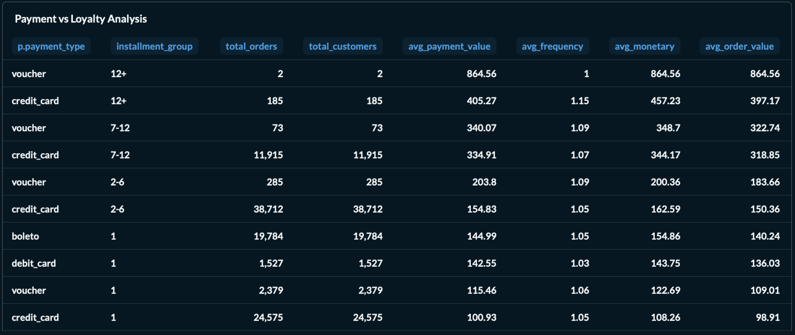


---

**[BHV-3] Customer Lifecycle Analysis**
```sql
SELECT
    CASE
        WHEN recency_days <= 90
             AND customer_tenure_days >= 365  THEN 'Active Loyal (≥1 tahun)'
        WHEN recency_days <= 90
             AND customer_tenure_days >= 180  THEN 'Active Regular (≥6 bln)'
        WHEN recency_days <= 90
             AND customer_tenure_days < 180   THEN 'Active New (< 6 bln)'
        WHEN recency_days BETWEEN 91 AND 180  THEN 'At Risk (91–180 hari)'
        WHEN recency_days BETWEEN 181 AND 365 THEN 'Lapsing (181–365 hari)'
        ELSE                                       'Churned (> 365 hari)'
    END                                             AS lifecycle_segment,
    COUNT(DISTINCT customer_unique_id)              AS total_customers,
    ROUND(AVG(monetary), 2)                         AS avg_monetary,
    ROUND(SUM(monetary), 2)                         AS total_revenue_at_risk,
    ROUND(AVG(frequency), 2)                        AS avg_frequency,
    ROUND(AVG(recency_days), 0)                     AS avg_recency_days
FROM analytics.customer_features
GROUP BY lifecycle_segment
ORDER BY MIN(recency_days) ASC;
```


---

## 9. Geo & Seller Analytics

Halaman ini menganalisis distribusi geografis pelanggan dan kinerja seller per region untuk mendukung keputusan ekspansi pasar dan optimalisasi logistik.

*Screenshot Geo & Seller Analytics dashboard*

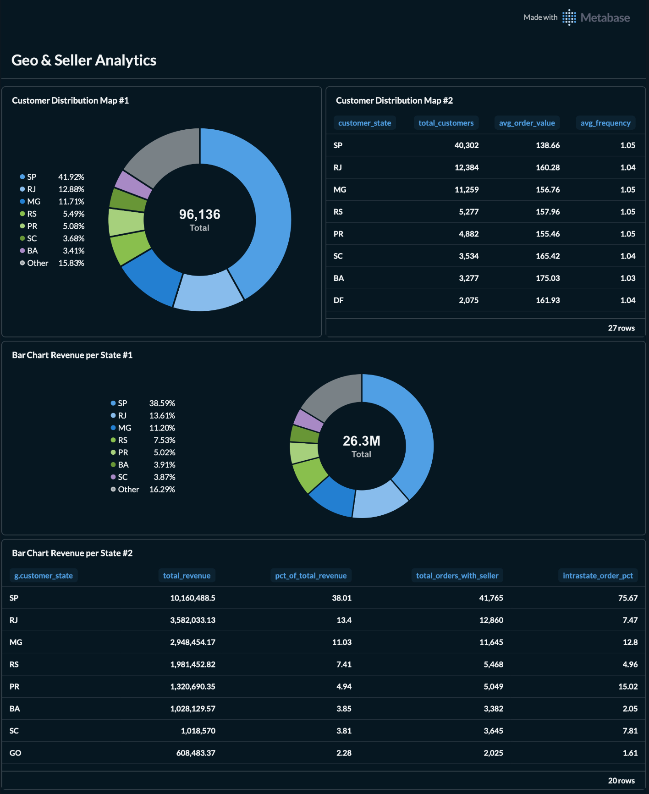

### Query yang Digunakan

**[GEO-1] Customer Distribution Map**
```sql
SELECT
    g.customer_state,
    COUNT(DISTINCT g.customer_unique_id)            AS total_customers,
    ROUND(SUM(c.monetary), 2)                       AS total_revenue,
    ROUND(AVG(c.avg_order_value), 2)                AS avg_order_value,
    ROUND(SUM(c.repeat_customer) * 100.0
        / COUNT(DISTINCT g.customer_unique_id), 2)  AS repeat_rate_pct,
    ROUND(AVG(g.geolocation_lat), 4)                AS avg_lat,
    ROUND(AVG(g.geolocation_lng), 4)                AS avg_lng,
    ROUND(SUM(c.monetary)
        / COUNT(DISTINCT g.customer_unique_id), 2)  AS revenue_per_customer
FROM analytics.geo_features g
LEFT JOIN analytics.customer_features c
    ON g.customer_unique_id = c.customer_unique_id
WHERE g.customer_state IS NOT NULL
  AND g.geolocation_lat IS NOT NULL
GROUP BY g.customer_state
ORDER BY total_revenue DESC;
```

---

**[GEO-2] Revenue by State Analysis**

```sql
SELECT
    g.customer_state,
    COUNT(DISTINCT g.customer_unique_id)            AS total_customers,
    ROUND(SUM(c.monetary), 2)                       AS total_revenue,
    ROUND(SUM(c.monetary) * 100.0
        / SUM(SUM(c.monetary)) OVER (), 2)          AS pct_of_total_revenue,
    COUNT(DISTINCT s.order_id)                      AS orders_with_seller_data,
    ROUND(AVG(toFloat64(s.same_state)) * 100, 2)    AS intrastate_order_pct,
    ROUND(AVG(s.freight_ratio), 4)                  AS avg_freight_ratio,
    ROUND(AVG(s.freight_value), 2)                  AS avg_freight_value
FROM analytics.geo_features g
LEFT JOIN analytics.customer_features c
    ON g.customer_unique_id = c.customer_unique_id
LEFT JOIN analytics.delivery_features d
    ON d.customer_id = g.customer_unique_id
LEFT JOIN analytics.seller_features s
    ON s.order_id = d.order_id
WHERE g.customer_state IS NOT NULL
GROUP BY g.customer_state
ORDER BY total_revenue DESC
LIMIT 20;
```

---

## 10. NLP: Keyword Extraction & Sentiment Score 

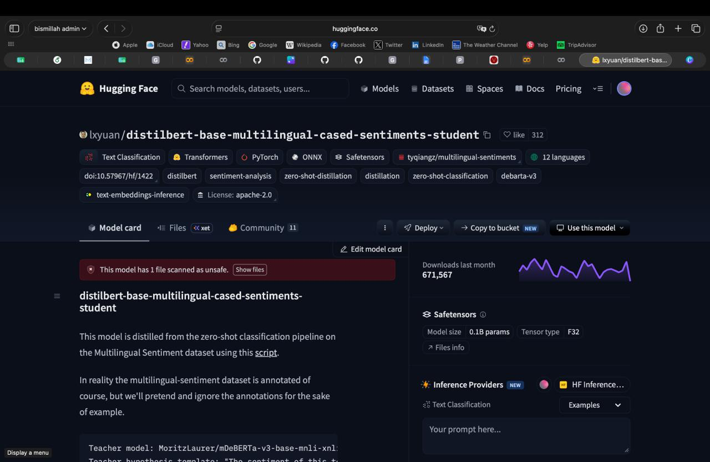
link: https://huggingface.co/lxyuan/distilbert-base-multilingual-cased-sentiments-student


Pipeline NLP berbasis **BERT Family** untuk menganalisis suara pelanggan dari 40.028 ulasan e-commerce Brazil (Olist), menghasilkan fitur sentimen dan keyword yang divisualisasikan di **Power BI Dashboard**.

---

### 10.1 Pipeline Overview

| Komponen | Detail |
|---|---|
| **Dataset** | `order_reviews`,  40.028 baris ulasan pelanggan |
| **Input** | `review_comment_message` |
| **Platform** | Google Colab (T4 GPU-accelerated) |
| **Sentiment Model** | `lxyuan/distilbert-base-multilingual-cased-sentiments-student` |
| **Keyword Model** | KeyBERT + `paraphrase-multilingual-MiniLM-L12-v2` |
| **Batch Size** | 32 |
| **Output File** | `voc_fp_mci.csv` (24 kolom, utf-8-sig, Power BI ready) |

---

### 10.2 Arsitektur Pipeline

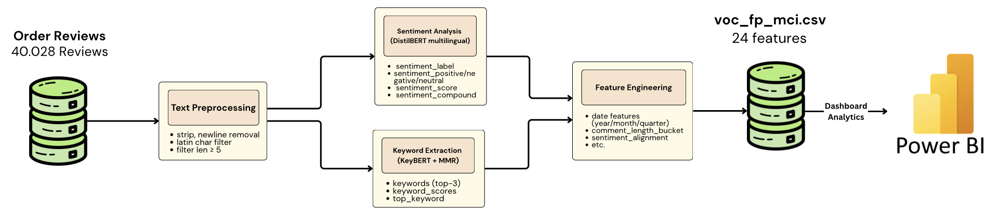

---

### 10.3 Analisis Sentimen: DistilBERT Pipeline

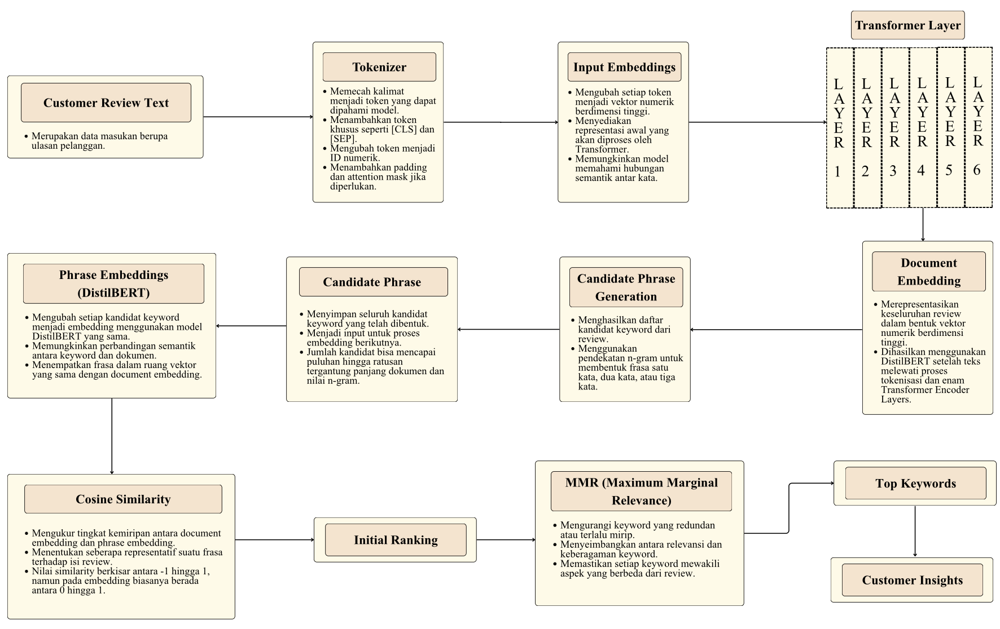

---

### 10.4 Keyword Extraction: KeyBERT Pipeline

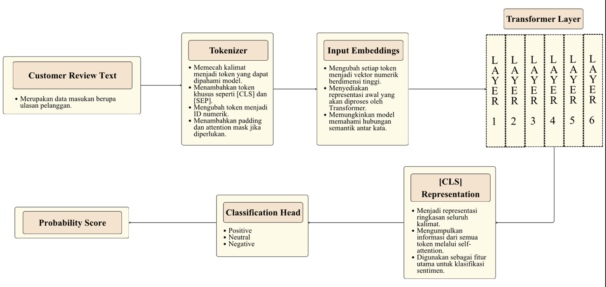

---

### 10.5 Output Kolom CSV (24 Kolom)

| Kategori | Kolom |
|---|---|
| **Identitas** | `review_id`, `order_id` |
| **Review asli** | `review_score`, `review_comment_title`, `review_comment_message` |
| **Sentiment** | `sentiment_label`, `sentiment_score`, `sentiment_positive`, `sentiment_negative`, `sentiment_neutral`, `sentiment_compound` |
| **Keyword** | `keywords`, `keyword_scores`, `top_keyword` |
| **Waktu** | `review_creation_date`, `review_answer_timestamp`, `review_year`, `review_month`, `review_month_name`, `review_quarter`, `review_yearmonth` |
| **Feature tambahan** | `comment_length`, `comment_length_bucket`, `sentiment_alignment` |

**Catatan kolom kunci:**
- `sentiment_compound` = `sentiment_positive − sentiment_negative` -> range [−1, +1], proxy tunggal intensitas sentimen
- `sentiment_alignment` = `Aligned / Misaligned` -> validasi konsistensi prediksi model terhadap `review_score` numerik
- `top_keyword` = keyword pertama/terkuat per review -> kolom tersendiri untuk memudahkan filter di Power BI

---

### 10.4 Power BI Dashboard

> *Screenshot Power BI Dashboard - Voice of Customer Analytics*

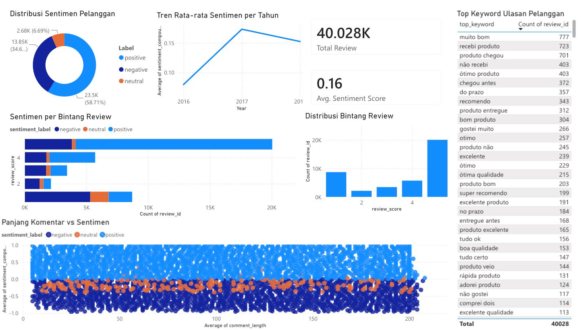

Dashboard dibagi ke dalam **3 area utama**:

#### Area 1 - Sentiment Overview (kiri atas)

**Donut Chart - Distribusi Sentimen Pelanggan**

Dari 40.028 ulasan yang diproses:
- **Positive: 23.5K (58.71%)**, mayoritas pelanggan puas
- **Negative: 13.85K (34.6%)**, segmen yang perlu perhatian
- **Neutral: 2.68K (6.69%)**, ulasan ambigu / informatif tanpa muatan emosi kuat

**Line Chart - Tren Rata-rata Sentimen per Tahun**

Rata-rata `sentiment_compound` menunjukkan tren naik dari 2016 ke 2017, mengindikasikan peningkatan kepuasan pelanggan secara keseluruhan dari waktu ke waktu.

#### Area 2 - Analisis Mendalam (kiri bawah & tengah)

**Stacked Bar - Sentimen per Bintang Review**

Cross-tab `review_score` vs `sentiment_label` menunjukkan pola yang konsisten:
- Bintang 5 didominasi oleh label `positive`
- Bintang 1–2 didominasi oleh label `negative`
- Bintang 3 menunjukkan distribusi yang lebih beragam, dengan proporsi `neutral` tertinggi

**Bar Chart - Distribusi Bintang Review**

Distribusi 1–5 bintang menunjukkan distribusi **right-skewed**, bintang 5 mendominasi dengan hampir 20K ulasan, diikuti bintang 4. Bintang 1–3 jauh lebih sedikit, konsisten dengan rata-rata `sentiment_compound` positif (0.16).

**Scatter Plot - Panjang Komentar vs Sentimen**

Plot `comment_length` vs `sentiment_compound` menunjukkan bahwa komentar negatif cenderung lebih panjang (pelanggan tidak puas lebih banyak menjelaskan), sementara komentar positif tersebar merata di semua panjang.

#### Area 3 - Top Keyword (kanan)

**Tabel - Top Keyword Ulasan Pelanggan**

30 keyword teratas dari seluruh ulasan, dengan `muito bom` (777x) sebagai keyword paling dominan, diikuti `recebi produto` (723x) dan `produto chegou` (701x). Keyword-keyword ini mencerminkan bahwa **pengiriman dan kualitas produk** adalah dua dimensi yang paling banyak dibicarakan pelanggan.

Keyword negatif yang muncul di top-30, seperti `não recebi` (403x) dan `não gostei` (117x) menjadi sinyal kuat area yang membutuhkan perbaikan.

---

### 10.5 KPI Cards

| Metric | Nilai |
|---|---|
| **Total Review diproses** | 40.028 |
| **Avg. Sentiment Score** (compound) | 0.16 |
| **Positive rate** | 58.71% |
| **Negative rate** | 34.6% |
| **Keyword null** | 12 baris (< 0.03%) |

---

## 11. Insight & Business Strategy

PULSE mengidentifikasi lima area bisnis utama yang memiliki pengaruh besar terhadap retensi pelanggan, pengalaman pelanggan, dan pertumbuhan bisnis secara berkelanjutan. Melalui integrasi customer analytics, behavioral analytics, customer experience analytics, dan Voice of Customer analytics. 

PULSE membantu menghasilkan insight dan rekomendasi strategis yang dapat digunakan sebagai dasar pengambilan keputusan berbasis data dan berorientasi pada pelanggan.

---

### 11.1 Krisis Customer Retention

#### Temuan Utama

- Total pelanggan: 93.358
- Pelanggan yang melakukan pembelian ulang: 2.801
- Pelanggan yang hanya membeli satu kali: 90.557
- Repeat Rate: 3,0%
- Rata-rata frekuensi pembelian: 1,03 order per pelanggan

#### Interpretasi Bisnis

Meskipun platform berhasil memperoleh lebih dari 93 ribu pelanggan, kemampuan mempertahankan pelanggan masih menjadi tantangan utama. Sekitar 97% pelanggan hanya melakukan satu kali transaksi dan tidak kembali melakukan pembelian.

Kondisi ini menunjukkan bahwa pertumbuhan bisnis saat ini masih lebih bergantung pada akuisisi pelanggan baru dibandingkan retensi pelanggan yang sudah ada. Padahal, biaya mempertahankan pelanggan umumnya lebih rendah dibandingkan biaya memperoleh pelanggan baru.

#### Rekomendasi Strategis

- Menjadikan Repeat Rate sebagai KPI utama bisnis.
- Mengembangkan program loyalitas untuk pelanggan yang sudah pernah melakukan pembelian ulang.
- Menjalankan program win-back campaign untuk pelanggan yang sudah tidak aktif.
- Menerapkan promosi yang dipersonalisasi berdasarkan riwayat transaksi pelanggan.
- Memperkuat strategi customer lifecycle management.

---

### 11.2 Customer Experience sebagai Indikator Retensi

#### Temuan Utama

- 42.997 pelanggan (46,1%) berada pada kategori Excellent
- 32.290 pelanggan (34,6%) berada pada kategori Good
- 18.071 pelanggan (19,3%) berada pada kategori Fair dan Poor

Pelanggan pada kategori CX yang lebih rendah secara konsisten menunjukkan:

- Review score yang lebih rendah
- Tingkat keluhan yang lebih tinggi
- Tingkat keterlambatan pengiriman yang lebih tinggi

#### Interpretasi Bisnis

Customer Experience (CX) dapat digunakan sebagai indikator awal untuk mengidentifikasi risiko churn pelanggan. Pelanggan yang memiliki pengalaman buruk cenderung lebih sering memberikan keluhan, memberikan ulasan negatif, dan tidak kembali melakukan pembelian.

Temuan ini menunjukkan bahwa kepuasan pelanggan tidak hanya ditentukan oleh produk, tetapi juga oleh kualitas layanan setelah transaksi terjadi.

#### Rekomendasi Strategis

- Melakukan monitoring CX Score secara berkala.
- Memprioritaskan recovery program untuk pelanggan kategori Fair dan Poor.
- Membangun layanan pelanggan yang lebih proaktif.
- Membuat sistem peringatan dini (early warning system) ketika kualitas pengalaman pelanggan mulai menurun.

---

### 11.3 Delivery Performance sebagai Akar Permasalahan

#### Temuan Utama

- Order yang diterima lebih cepat dari estimasi memiliki review score tertinggi.
- Kepuasan pelanggan menurun seiring meningkatnya keterlambatan pengiriman.
- Keterlambatan lebih dari 14 hari menghasilkan review score terendah.
- Cancellation rate meningkat signifikan ketika keterlambatan melebihi satu minggu.
- Repeat purchase behavior menurun seiring bertambahnya keterlambatan pengiriman.

#### Interpretasi Bisnis

Delivery performance bukan hanya metrik operasional, tetapi merupakan salah satu faktor yang paling berpengaruh terhadap kepuasan pelanggan, loyalitas pelanggan, dan tingkat pembatalan transaksi.

Semakin buruk performa pengiriman, semakin rendah tingkat kepercayaan pelanggan terhadap platform. Dampaknya tidak hanya terlihat pada review score, tetapi juga pada retensi pelanggan dalam jangka panjang.

#### Rekomendasi Strategis

- Mengurangi jumlah order yang mengalami keterlambatan lebih dari 7 hari.
- Mengimplementasikan sistem prediksi keterlambatan pengiriman.
- Meningkatkan transparansi proses tracking pengiriman.
- Memberikan komunikasi proaktif kepada pelanggan yang terdampak keterlambatan.
- Menyediakan kompensasi atau recovery program untuk keterlambatan ekstrem.

---

### 11.4 Validasi melalui Voice of Customer Analytics

#### Temuan Utama

Analisis terhadap 40.028 ulasan pelanggan menunjukkan:

| Sentimen | Persentase |
|-----------|-----------:|
| Positif | 58,71% |
| Negatif | 34,60% |
| Netral | 6,69% |

Topik yang paling sering muncul dalam ulasan pelanggan:

- Masalah pengiriman (delivery issues)
- Komunikasi seller
- Permasalahan produk

#### Interpretasi Bisnis

Voice of Customer Analytics memvalidasi hasil yang sebelumnya ditemukan melalui Customer Experience Analytics dan Behavioral Analytics.

Menariknya, sebagian besar ketidakpuasan pelanggan tidak berasal dari harga produk, melainkan dari kualitas layanan dan proses pemenuhan pesanan setelah transaksi dilakukan.

#### Rekomendasi Strategis

- Melakukan monitoring sentimen pelanggan secara berkala.
- Mengintegrasikan hasil NLP ke dalam monitoring operasional.
- Melakukan analisis akar masalah terhadap tema keluhan yang berulang.
- Menjadikan feedback pelanggan sebagai salah satu indikator evaluasi seller dan logistik.
- Membangun sistem monitoring ulasan pelanggan secara otomatis.

---

### 11.5 Konteks Geografis

#### Temuan Utama

Distribusi pelanggan terkonsentrasi pada tiga state utama:

| State | Persentase Pelanggan |
|---------|-----------:|
| São Paulo (SP) | 41,92% |
| Rio de Janeiro (RJ) | 12,88% |
| Minas Gerais (MG) | 11,71% |

Ketiga wilayah tersebut secara bersama-sama menyumbang:

- Sekitar 66,5% basis pelanggan
- Lebih dari 62% total revenue

#### Interpretasi Bisnis

Meskipun bukan fokus utama customer-centric analytics, analisis geografis membantu menentukan wilayah yang memiliki dampak terbesar terhadap performa bisnis.

Karena sebagian besar pelanggan terkonsentrasi pada beberapa wilayah tertentu, perbaikan layanan yang dilakukan pada wilayah tersebut berpotensi menghasilkan dampak yang jauh lebih besar dibandingkan wilayah lainnya.

#### Rekomendasi Strategis

- Memprioritaskan peningkatan customer experience pada SP, RJ, dan MG.
- Memperkuat jaringan seller dan logistik pada wilayah dengan konsentrasi pelanggan tertinggi.
- Menggunakan insight geografis untuk menentukan prioritas ekspansi bisnis.
- Mengalokasikan sumber daya operasional berdasarkan distribusi pelanggan.
---

## 12. Executive Summary

### <u>**Key Findings**</u>

### Customer Retention

* Platform melayani **93,358 pelanggan unik**, namun hanya sekitar **3%** yang melakukan pembelian ulang.
* Sebanyak **97% pelanggan** merupakan one-time buyers, menunjukkan bahwa tantangan utama bisnis terletak pada customer retention, bukan customer acquisition.
* Segmen **At Risk, Lapsing, dan Churned** mendominasi customer lifecycle, sementara pelanggan loyal aktif hanya mencakup sebagian kecil basis pelanggan.

### Customer Experience

* Analisis CX menunjukkan bahwa lebih dari **18 ribu pelanggan** berada pada kategori **Fair** dan **Poor**, yang memiliki complaint rate dan late delivery rate lebih tinggi dibanding kategori lainnya.
* Delivery muncul sebagai faktor yang paling konsisten memengaruhi kepuasan pelanggan.
* Customer dengan pengalaman pengiriman yang buruk cenderung memberikan review score yang lebih rendah dan memiliki risiko churn yang lebih tinggi.

### Delivery Impact

* Keterlambatan pengiriman berkorelasi langsung dengan penurunan review score dan repeat purchase behavior.
* Cancellation rate meningkat secara signifikan pada order yang mengalami keterlambatan lebih dari dua minggu.
* Delivery performance terbukti menjadi driver utama customer satisfaction, retention, dan cancellation behavior.

### Voice of Customer Analytics

* Analisis terhadap **40,028 ulasan pelanggan** menunjukkan distribusi sentimen sebesar **58.71% positif**, **34.60% negatif**, dan **6.69% netral**.
* Keyword extraction mengidentifikasi **delivery issues**, **seller communication**, dan **product-related concerns** sebagai topik dominan dalam ulasan pelanggan.
* Hasil Voice of Customer secara konsisten memvalidasi temuan Customer Experience dan Behavioral Analytics bahwa delivery merupakan sumber utama ketidakpuasan pelanggan.

### Geographic Context

* Aktivitas pelanggan terkonsentrasi pada **São Paulo (SP), Rio de Janeiro (RJ), dan Minas Gerais (MG)**.
* Ketiga wilayah tersebut menyumbang sekitar **66.5% basis pelanggan** dan lebih dari **62% total revenue**.
* Perbaikan customer experience pada wilayah-wilayah utama ini berpotensi menghasilkan dampak bisnis yang paling signifikan.

---

### <u>**Strategic Recommendations**</u>

* Menjadikan **customer retention** sebagai KPI utama melalui loyalty program, win-back campaign, dan personalized promotion.
* Memprioritaskan peningkatan **delivery performance** untuk mengurangi churn dan meningkatkan customer satisfaction.
* Mengimplementasikan sistem monitoring keterlambatan pengiriman dan proactive customer communication.
* Memanfaatkan **Voice of Customer Analytics** sebagai mekanisme monitoring kualitas layanan dan identifikasi masalah pelanggan secara berkelanjutan.
* Memfokuskan inisiatif customer experience pada wilayah dengan konsentrasi pelanggan tertinggi untuk memperoleh dampak bisnis yang lebih besar.

---

### <u>**Business Impact**</u>

* Mengidentifikasi bahwa **customer retention** merupakan tantangan bisnis utama dengan repeat rate hanya sekitar **3%**.
* Menemukan bahwa **delivery performance** merupakan faktor paling berpengaruh terhadap kepuasan pelanggan, loyalitas, dan cancellation behavior.
* Memvalidasi temuan customer analytics menggunakan pendekatan **Voice of Customer Analytics** berbasis NLP.
* Menyediakan framework customer intelligence yang mengintegrasikan customer analytics, customer experience analytics, behavioral analytics, dan customer feedback analytics dalam satu platform terpadu.
* Mendukung pengambilan keputusan yang lebih cepat dan lebih customer-centric melalui pipeline analytics yang terotomatisasi dan dashboard interaktif.

---

## 13. Challenges & Limitations

Selama pengembangan PULSE, terdapat beberapa tantangan dan keterbatasan yang memengaruhi proses analisis maupun interpretasi hasil.

### 13.1 Distribusi Data yang Tidak Seimbang

Beberapa atribut pada dataset memiliki distribusi yang sangat tidak seimbang (skewed distribution). Sebagai contoh, sebagian besar pelanggan hanya melakukan satu kali pembelian, sementara hanya sebagian kecil yang melakukan pembelian berulang.

Kondisi ini menyebabkan beberapa visualisasi menjadi kurang informatif karena kategori tertentu mendominasi keseluruhan distribusi data. Oleh karena itu, beberapa analisis memerlukan segmentasi tambahan agar pola yang lebih detail dapat terlihat.

---

### 13.2 Keterbatasan Metabase

Metabase tidak selalu menyimpan state terakhir dashboard, termasuk filter, sorting, maupun konfigurasi eksplorasi data yang sedang digunakan.

Akibatnya, proses analisis terkadang memerlukan konfigurasi ulang dashboard ketika sesi kerja baru dimulai.

---

### 13.3 Keterbatasan Analisis NLP

Seluruh ulasan pelanggan ditulis dalam Bahasa Portugis. Meskipun DistilBERT Multilingual mampu melakukan klasifikasi sentimen dengan baik, model tetap memiliki keterbatasan dalam memahami konteks lokal, slang, singkatan, maupun ekspresi khusus yang digunakan pelanggan.

Hal ini dapat menyebabkan sebagian kecil hasil klasifikasi sentimen atau ekstraksi keyword tidak sepenuhnya merepresentasikan maksud asli pelanggan.

---

## 14. Penutup

Platform ini berhasil mengimplementasikan arsitektur **Big Data end-to-end** yang mencakup:

- **Automated ingestion** dari Google Drive -> Data Lake
- **Scalable processing** dengan Apache Spark untuk 6 feature tables
- **Full orchestration** via Apache Airflow DAG
- **OLAP warehouse** di ClickHouse dengan 7 analytics tables
- **Interactive dashboard** di Metabase dengan query spesifik per KPI
- **Regex-based NLP** untuk complaint topic classification (6 kategori)
- **CX Score** composite metric yang menggabungkan 4 dimensi pengalaman pelanggan
- **NLP Sentiment** dengan DistilBERT + KeyBERT

---

<div align="center">

**Institut Teknologi Sepuluh Nopember**
<br>
Departemen Teknik Informatika - 2025/2026
<br><br>

| Nama | NRP |
|---|---|
| **Ibrahim Ferel** | 5025241049 |

<br>

*Manajemen Cerdas Informasi*

</div>