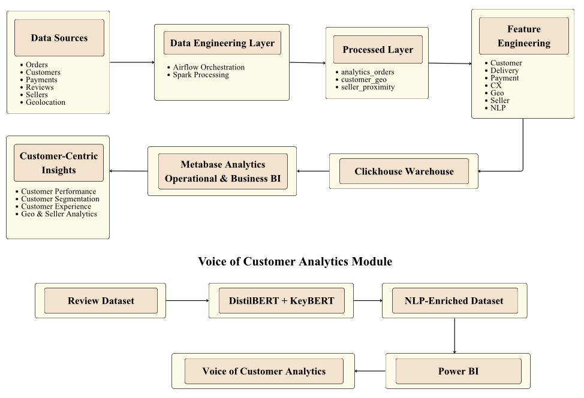
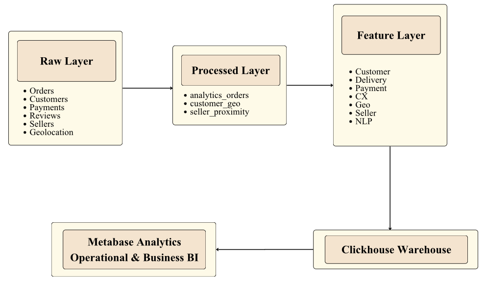
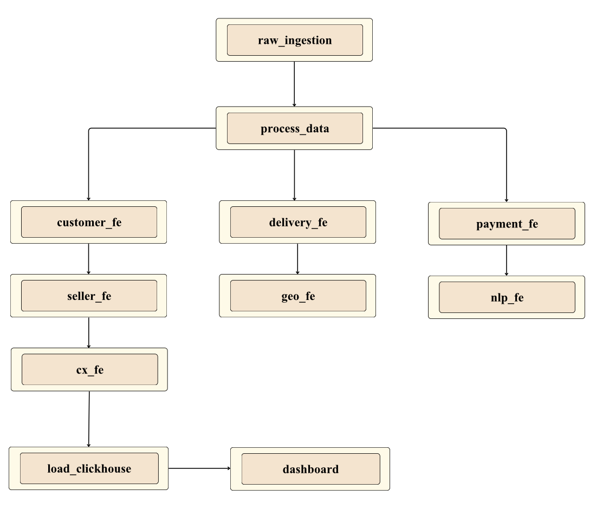
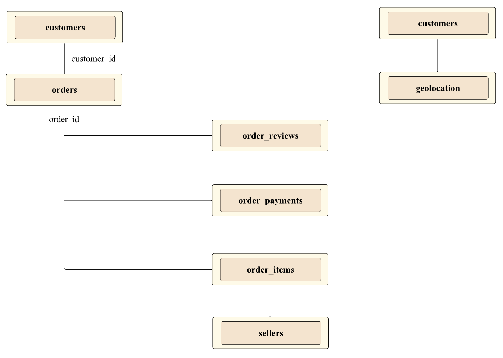
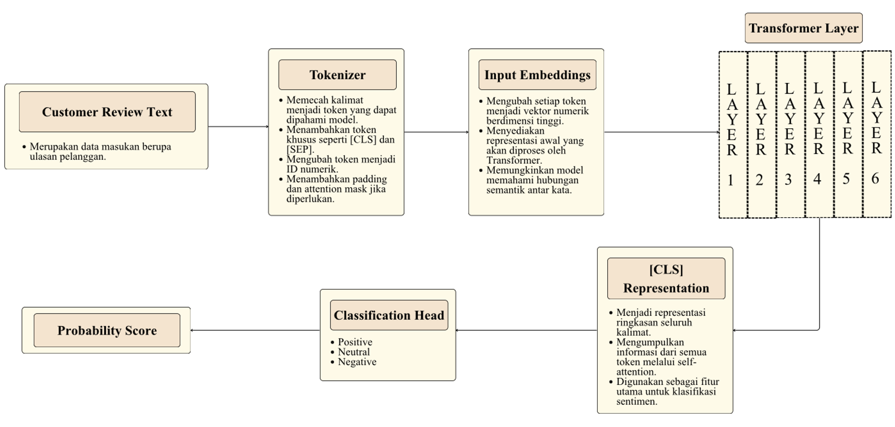
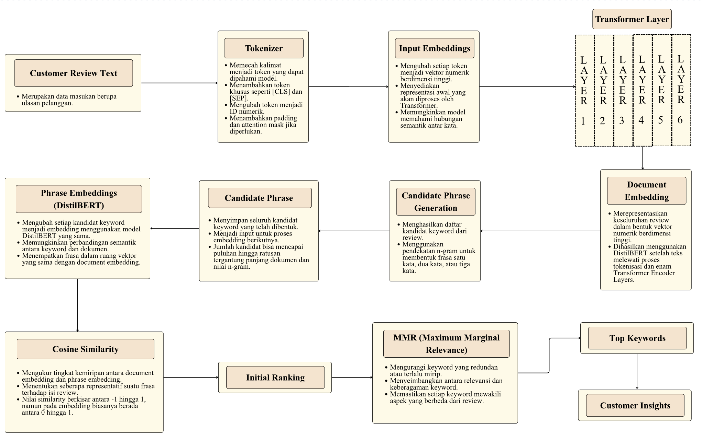
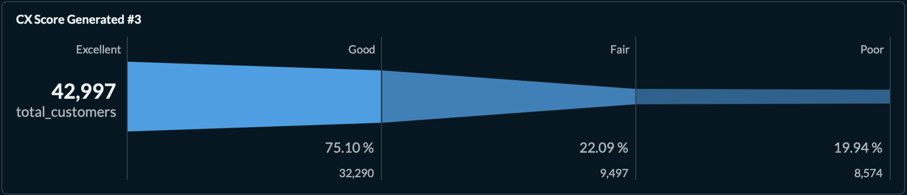
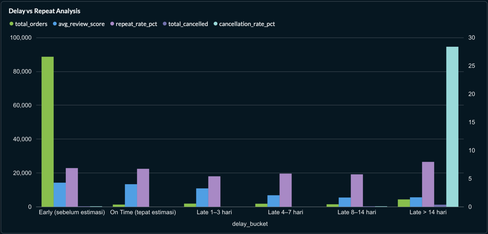
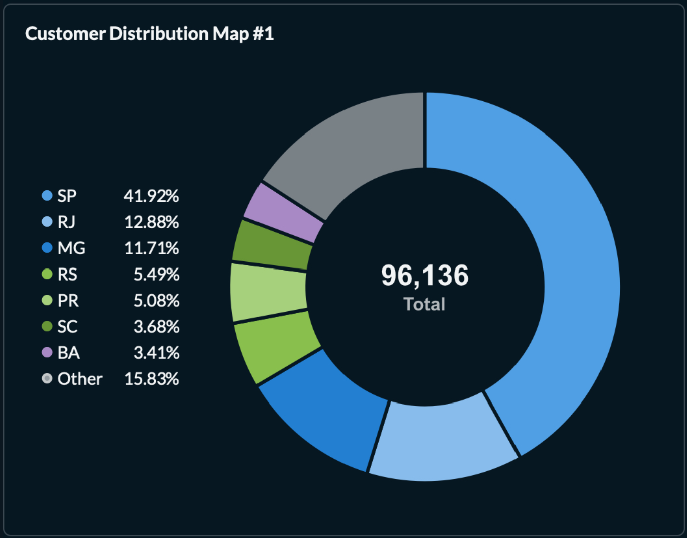
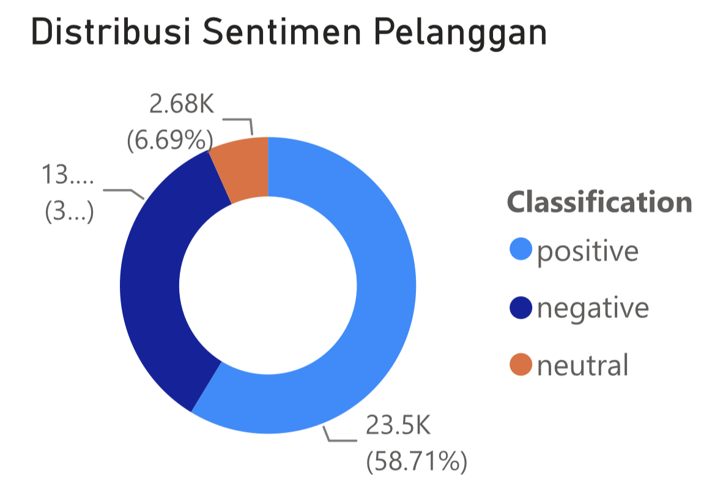

::: IEEEkeywords
Customer Analytics, Business Intelligence, Data Engineering, Customer
Experience, Voice of Customer, Apache Spark, Apache Airflow, ClickHouse,
DistilBERT, KeyBERT.
:::

# Introduction

E-commerce platforms generate large volumes of transactional,
behavioral, geographic, and customer-generated data. Transforming these
heterogeneous data sources into actionable intelligence has become a
critical competitive advantage for organizations seeking to improve
customer retention, customer experience, and operational
performance [@davenport2007]. However, despite the increasing adoption
of business intelligence solutions, many analytical initiatives remain
fragmented across organizational functions. Revenue analytics, customer
segmentation, operational monitoring, and customer feedback analysis are
often conducted independently, resulting in isolated insights that fail
to provide a comprehensive understanding of customer behavior and
business performance [@lemon2016].

Recent advances in data engineering and analytics architectures have
enabled organizations to process large-scale datasets more efficiently.
Nevertheless, most customer analytics implementations still focus
primarily on descriptive reporting and dashboard generation. While these
approaches successfully identify historical patterns, they often lack an
integrated framework capable of connecting customer performance,
customer experience, operational metrics, and Voice of Customer
intelligence into a unified decision-support system [@kleppmann2017].

To address this challenge, this study proposes **PULSE** (**P**latform
for **U**nified Customer Ana**l**ytics and Bu**s**iness
Int**e**lligence), an end-to-end customer analytics framework built upon
a modern data engineering architecture and applied to the Brazilian
Olist E-Commerce Dataset [@olist2018]. The framework integrates workflow
orchestration, large-scale data processing, analytical warehousing,
business intelligence visualization, and Voice of Customer analytics
through sentiment analysis and keyword extraction techniques.

The proposed framework processes more than 99,000 transactions and
93,000 customers through a layered architecture consisting of raw,
processed, and feature layers. Seven analytical datasets are generated
to support customer performance monitoring, customer segmentation,
customer experience evaluation, behavioral analytics, geographic
analysis, seller performance assessment, and customer feedback
intelligence. The resulting analytics reveal several key business
challenges, including low customer retention, delivery-related
dissatisfaction, geographic revenue concentration, and recurring
complaint patterns.

The primary contribution of this study is the development of an
integrated customer analytics ecosystem that combines data engineering,
business intelligence, and Voice of Customer analytics within a unified
decision-support framework. By consolidating multiple analytical
perspectives into a single platform, PULSE enables organizations to
transform raw e-commerce data into actionable insights that support
customer-centric decision making.

# Related Work

## Customer Analytics

Customer analytics enables organizations to understand purchasing
behavior, identify high-value customers, and develop effective retention
strategies. Techniques such as Recency, Frequency, and Monetary (RFM)
analysis have been widely adopted to support customer segmentation and
personalized marketing initiatives [@fader2005]. Furthermore, customer
analytics provides insights into customer loyalty and long-term
profitability [@davenport2007].

## Customer Experience Analytics

Customer experience (CX) has emerged as a critical determinant of
customer satisfaction, retention, and business performance. According to
Lemon and Verhoef [@lemon2016], customer experience is shaped by every
interaction that occurs throughout the customer journey. In e-commerce
environments, customer experience is influenced by multiple factors,
including delivery performance, service quality, product quality, and
post-purchase support. As a result, organizations increasingly utilize
customer feedback, review ratings, and operational metrics to evaluate
customer satisfaction and identify service improvement opportunities.

## Voice of Customer Analytics

The growing availability of customer-generated textual data has led to
the emergence of Voice of Customer (VoC) analytics. VoC analytics
focuses on extracting customer opinions, concerns, and expectations from
reviews, comments, and other forms of feedback. Recent advancements in
Natural Language Processing (NLP) have significantly improved the
ability to analyze textual customer feedback. Transformer-based language
models such as BERT have demonstrated strong performance in sentiment
classification tasks [@devlin2019], while keyword extraction approaches
such as KeyBERT enable the identification of dominant topics within
customer reviews [@grootendorst2020]. These techniques provide
organizations with deeper insights into customer perceptions beyond
traditional numerical ratings.

## Modern Data Engineering and Business Intelligence

The increasing volume and variety of organizational data have
accelerated the adoption of modern data engineering architectures.
Contemporary analytics platforms commonly employ layered data
architectures consisting of raw, processed, and analytical layers to
support scalable data processing and governance [@kleppmann2017].
Workflow orchestration tools, distributed processing frameworks,
analytical databases, and business intelligence platforms are frequently
integrated to transform raw data into actionable business intelligence.
Such architectures enable organizations to support data-driven decision
making while maintaining scalability, reliability, and analytical
flexibility.

# PULSE Framework and System Architecture

## Overview of the PULSE Framework

PULSE (Platform for Unified Customer Analytics and Business
Intelligence) is an end-to-end analytics framework that transforms raw
e-commerce data into actionable business intelligence. The framework
integrates data engineering, analytical warehousing, business
intelligence, and Voice of Customer analytics within a unified
ecosystem. By processing transaction, customer, payment, seller,
geolocation, and review data, PULSE supports customer performance
monitoring, segmentation, customer experience evaluation, behavioral
analytics, geographic analysis, seller performance assessment, and
customer feedback intelligence.

<figure id="fig:pulse_architecture" data-latex-placement="htbp">

<figcaption>Overall architecture of the proposed PULSE
framework.</figcaption>
</figure>

As illustrated in Fig. [1](#fig:pulse_architecture){reference-type="ref"
reference="fig:pulse_architecture"}, PULSE transforms heterogeneous
e-commerce data into customer-centric business insights through an
integrated analytics architecture. The framework combines structured
business analytics with a dedicated Voice of Customer module powered by
DistilBERT and KeyBERT.

## System Architecture

The proposed PULSE architecture adopts a layered data engineering
approach consisting of data ingestion, processing, feature engineering,
analytical warehousing, and business intelligence components.

Raw e-commerce data, including orders, customers, payments, reviews,
sellers, and geolocation records, are first collected and stored within
the raw layer. Apache Spark is then used to perform cleansing,
integration, and transformation processes, producing three processed
datasets: `analytics_orders`, `customer_geo`, and `seller_proximity`.

These processed datasets are further transformed into seven analytical
feature datasets supporting customer performance, segmentation, customer
experience, behavioral, seller, payment, and geographic analytics. The
resulting datasets are loaded into ClickHouse, which serves as the
central analytical warehouse for structured business intelligence
reporting.

For dashboard analytics, Metabase is utilized to provide interactive
visualizations and business monitoring capabilities. Additionally, a
dedicated Voice of Customer module employs DistilBERT for sentiment
classification and KeyBERT for keyword extraction. The NLP-enriched
review dataset is subsequently visualized through Power BI to support
customer feedback and sentiment analysis.

<figure id="fig:layered_arch" data-latex-placement="htbp">

<figcaption>Layered data architecture of the proposed PULSE
framework.</figcaption>
</figure>

As illustrated in Fig. [2](#fig:layered_arch){reference-type="ref"
reference="fig:layered_arch"}, PULSE adopts a layered architecture
consisting of raw, processed, and feature layers. The engineered
datasets are loaded into ClickHouse for analytical querying and
dashboard generation, ensuring scalable and reproducible data workflows.

## Technology Stack

Several technologies were integrated to support the implementation of
the proposed framework. Apache Airflow was employed to orchestrate the
end-to-end workflow and automate pipeline execution. Apache Spark was
used for distributed data processing and feature generation. ClickHouse
served as the analytical warehouse due to its high-performance OLAP
capabilities. Metabase and Power BI were utilized for dashboard
development and business intelligence reporting. Additionally,
DistilBERT and KeyBERT were incorporated to enable sentiment analysis
and keyword extraction within the Voice of Customer module.

::: {#tab:tech_stack}
  **Layer**                **Technology**
  ------------------------ ---------------------
  Workflow Orchestration   Apache Airflow
  Data Processing          Apache Spark
  Data Warehouse           ClickHouse
  Business Intelligence    Metabase, Power BI
  NLP Analytics            DistilBERT, KeyBERT
  Containerization         Docker

  : Technology Stack Used in PULSE
:::

Table [1](#tab:tech_stack){reference-type="ref"
reference="tab:tech_stack"} summarizes the primary technologies utilized
in the implementation of PULSE. Each component was selected based on its
role within the analytics pipeline, ranging from workflow orchestration
and distributed processing to analytical warehousing, business
intelligence, and NLP-based customer feedback analysis.

## Data Flow and Workflow Orchestration

To ensure automation and reproducibility, the analytical workflow is
orchestrated using Apache Airflow. The pipeline automates data
ingestion, processing, feature engineering, and warehouse loading
through a series of modular tasks. This orchestration approach improves
data consistency, reduces manual intervention, and supports scalable
analytics workflows.

<figure id="fig:airflow_dag" data-latex-placement="htbp">

<figcaption>Apache Airflow workflow orchestration in PULSE.</figcaption>
</figure>

As illustrated in Fig. [3](#fig:airflow_dag){reference-type="ref"
reference="fig:airflow_dag"}, Apache Airflow orchestrates the end-to-end
analytics pipeline by managing task dependencies across data processing,
feature engineering, and warehouse loading stages.

# Dataset Description

## Source Dataset

This study utilizes the Brazilian Olist E-Commerce Dataset, a publicly
available dataset that contains transactional records from a large-scale
e-commerce marketplace operating in Brazil [@olist2018]. The dataset
consists of multiple relational tables describing customer profiles,
orders, payments, reviews, sellers, and geolocation information. Due to
its comprehensive coverage of customer journeys and business operations,
the dataset has been widely used for customer analytics, recommendation
systems, and business intelligence research.

The Olist dataset was selected because it provides both structured
transactional data and unstructured customer feedback, enabling the
implementation of an integrated analytics framework that combines
customer analytics, customer experience measurement, and Voice of
Customer analysis.

::: {#tab:dataset_stats}
  **Dataset**     **Records** **Description**
  ------------- ------------- ------------------------------
  Orders               99,441 Transaction records
  Customers            99,441 Customer profiles
  Reviews              99,224 Customer reviews and ratings
  Payments            103,886 Payment transaction records
  Sellers               3,095 Seller profiles
  Geolocation       1,000,163 Geographic coordinates

  : Source Dataset Statistics
:::

Table [2](#tab:dataset_stats){reference-type="ref"
reference="tab:dataset_stats"} summarizes the primary datasets used
throughout this study. The dataset contains approximately 100,000
transactions and more than 93,000 unique customers, providing sufficient
scale for customer analytics, customer experience evaluation, and Voice
of Customer analysis.

## Entity Relationship

<figure id="fig:erd" data-latex-placement="htbp">

<figcaption>Entity relationship of the Olist e-commerce
dataset.</figcaption>
</figure>

As illustrated in Fig. [4](#fig:erd){reference-type="ref"
reference="fig:erd"}, the orders table serves as the central entity
connecting customers, payments, reviews, and sellers. Customer
information is linked through customer identifiers, while seller-related
information is associated through order items. In addition, geolocation
records provide geographic context for customer analytics and regional
business analysis. This relational structure enables the integration of
transactional, operational, and customer-generated data within a unified
analytical framework.

# Data Engineering Pipeline

## Data Ingestion Layer

The data engineering pipeline begins with the ingestion of raw
e-commerce datasets obtained from the Olist public dataset. Each source
table is extracted and converted into Parquet format to improve storage
efficiency and processing performance. The raw layer serves as the
foundation of the analytical pipeline and preserves the original dataset
structure for traceability and reproducibility purposes.

Apache Airflow orchestrates the ingestion process, ensuring that all
source datasets are consistently loaded before downstream processing
tasks are executed.

## Processed Layer

::: {#tab:processed}
  **Dataset**          **Purpose**
  -------------------- -------------------------------------
  `analytics_orders`   Central transaction analytics table
  `customer_geo`       Customer location analytics
  `seller_proximity`   Seller-customer geographic analysis

  : Processed Datasets
:::

To simplify downstream feature engineering, three processed datasets
were generated from the raw source tables. The `analytics_orders`
dataset integrates transactional, payment, review, and customer
information into a centralized analytical table. The `customer_geo`
dataset enriches customer records with geographic coordinates, while
`seller_proximity` supports geographic and seller-related analysis by
combining seller and customer location information.

## Feature Engineering Datasets

::: {#tab:features}
  **Dataset**           **Purpose**
  --------------------- -------------------------------------
  `customer_features`   Customer segmentation and retention
  `delivery_features`   Delivery performance analysis
  `payment_features`    Payment behavior analysis
  `seller_features`     Seller performance evaluation
  `geo_features`        Geographic analytics
  `cx_features`         Customer experience measurement
  `nlp_features`        Voice of Customer analytics

  : Feature Engineering Datasets
:::

The processed datasets are further transformed into seven
domain-specific analytical datasets designed to support customer
analytics, customer experience evaluation, payment behavior analysis,
seller performance assessment, geographic analytics, and Voice of
Customer intelligence. Each dataset contains engineered features
tailored to a specific business objective, as summarized in
Table [4](#tab:features){reference-type="ref" reference="tab:features"}.

## Data Warehouse Loading

The engineered analytical datasets are loaded into ClickHouse, which
functions as the centralized analytical warehouse within the PULSE
framework. ClickHouse was selected due to its high-performance columnar
storage architecture and suitability for Online Analytical Processing
(OLAP) workloads.

Each feature dataset is stored as an independent analytical table,
enabling efficient querying, dashboard generation, and business
intelligence reporting. The warehouse layer serves as the primary data
source for structured analytics and supports the customer-centric
dashboards implemented within PULSE.

# Analytics Framework

## Customer Performance Analytics

Customer Performance Analytics provides a high-level overview of
business performance by monitoring key customer and revenue indicators.
This analytical component focuses on measuring overall revenue
generation, customer acquisition, customer spending behavior, and
retention performance.

Four primary Key Performance Indicators (KPIs) are utilized within this
framework: Total Revenue, Total Customers, Average Order Value (AOV),
and Repeat Rate. Collectively, these metrics provide a summary of
customer growth, purchasing behavior, and overall business performance.

::: {#tab:cx_kpi}
  **KPI**                     **Description**
  --------------------------- -------------------------
  Total Revenue               Total sales value
  Total Customers             Customer count
  Average Order Value (AOV)   Average order value
  Repeat Rate                 Customer retention rate

  : Customer Performance KPIs
:::

## Customer Segmentation

Customer Segmentation is performed using the Recency, Frequency, and
Monetary (RFM) framework, a widely adopted approach for evaluating
customer value and engagement [@fader2005]. This framework enables the
identification of customer purchasing behavior based on transaction
recency, purchase frequency, and spending level. The resulting
segmentation supports customer retention analysis and provides a
foundation for personalized marketing and customer lifecycle management
strategies.

::: {#tab:rfm_metrics}
  **KPI**     **Description**
  ----------- --------------------------
  Recency     Days since last purchase
  Frequency   Number of purchases
  Monetary    Total customer spending

  : RFM Segmentation Metrics
:::

## Customer Experience Analytics

Customer Experience (CX) Analytics evaluates customer satisfaction by
integrating multiple operational and behavioral indicators into a
unified Customer Experience Score (CX Score). The framework considers
review ratings, delivery performance, complaint behavior, and loyalty
indicators to provide a holistic assessment of customer experience.

::: {#tab:cx_components}
  **Component**          **Description**                **Weight**
  ---------------------- ------------------------------ ------------
  Review Score           Customer rating (1--5 stars)   0.4
  Delivery Performance   Delivery reliability           0.3
  Complaint Behavior     Complaint frequency            0.2
  Loyalty Indicator      Repeat purchase behavior       0.1

  : CX Score Components
:::

By consolidating multiple customer satisfaction signals into a single
metric, the framework enables organizations to identify customer groups
that require service improvement or retention initiatives.

## Behavioral Analytics

Behavioral Analytics examines the relationships between operational
performance and customer behavior. Within the proposed framework,
delivery performance serves as a key explanatory factor influencing
customer satisfaction, retention, and cancellation behavior.
Understanding these relationships enables organizations to identify
operational factors that directly impact customer experience and
long-term customer loyalty.

## Geo & Seller Analytics

Geo & Seller Analytics evaluates business performance from a regional
perspective by combining customer, seller, and geographic information.
The framework supports the analysis of revenue distribution, customer
concentration, seller coverage, and regional operational performance.
Geographic analysis enables the identification of high-performing
regions and areas with growth potential, while seller analytics provides
insights into seller distribution and logistics-related performance
across different locations.

# Voice of Customer Analytics

## Sentiment Analysis

Sentiment analysis aims to automatically identify the emotional polarity
expressed within textual customer reviews. In the context of Voice of
Customer analytics, sentiment classification enables organizations to
understand customer satisfaction levels and uncover perceptions that may
not be captured through numerical ratings alone [@liu2012].

This study employs DistilBERT Multilingual, a compressed version of the
Bidirectional Encoder Representations from Transformers (BERT)
architecture. DistilBERT utilizes knowledge distillation to reduce model
size while preserving most of BERT's language understanding
capabilities [@sanh2019]. Compared to the original BERT architecture
consisting of twelve transformer encoder layers, DistilBERT reduces the
architecture to six transformer layers, resulting in faster inference
and lower computational requirements.

<figure id="fig:distilbert" data-latex-placement="htbp">

<figcaption>DistilBERT-based sentiment classification architecture for
customer review analysis.</figcaption>
</figure>

As illustrated in Fig. [5](#fig:distilbert){reference-type="ref"
reference="fig:distilbert"}, customer reviews are first tokenized and
converted into contextual embeddings. These embeddings are subsequently
processed through six Transformer encoder layers in DistilBERT, where
the self-attention mechanism captures semantic relationships between
words. The attention operation is computed as: $$\begin{equation}
  \text{Attention}(Q,K,V) =
    \text{softmax}\!\left(\frac{QK^\top}{\sqrt{d_k}}\right)V
  \label{eq:attention}
\end{equation}$$ where $Q$, $K$, and $V$ denote the Query, Key, and
Value matrices, respectively.

The final contextual representation associated with the `[CLS]` token is
then forwarded to a classification head, which generates sentiment
probabilities using the Softmax function: $$\begin{equation}
  P(y_i) = \frac{e^{z_i}}{\displaystyle\sum_{j=1}^{C} e^{z_j}}
  \label{eq:softmax}
\end{equation}$$ where $z_i$ represents the logit score for class $i$
and $C$ denotes the number of sentiment categories. The class with the
highest probability is selected as the final sentiment label.

## Keyword Extraction

While sentiment analysis explains how customers feel, keyword extraction
helps identify the topics responsible for those sentiments. Keyword
extraction is therefore used to reveal recurring themes and issues
discussed within customer reviews.

This study utilizes KeyBERT, a transformer-based keyword extraction
technique that leverages contextual embeddings generated by BERT-family
language models [@grootendorst2020]. Unlike traditional frequency-based
methods such as TF-IDF, KeyBERT identifies keywords by measuring
semantic similarity between the entire document embedding and candidate
phrase embeddings.

<figure id="fig:keybert" data-latex-placement="htbp">

<figcaption>KeyBERT-based keyword extraction workflow for customer
review analysis.</figcaption>
</figure>

As illustrated in Fig. [6](#fig:keybert){reference-type="ref"
reference="fig:keybert"}, KeyBERT extracts representative keywords by
comparing document embeddings with candidate phrase embeddings generated
from customer reviews. Keyword relevance is determined using cosine
similarity: $$\begin{equation}
  \text{CosineSimilarity}(A,B) = \frac{A \cdot B}{\|A\|\,\|B\|}
  \label{eq:cosine}
\end{equation}$$ where $A$ denotes the document embedding and $B$
represents a candidate phrase embedding. Candidate phrases are ranked
according to their similarity scores and subsequently refined using
Maximum Marginal Relevance (MMR): $$\begin{equation}
  \text{MMR} = \underset{D_i \in R \setminus S}{\arg\max}\bigl[
    \lambda \cdot \text{Sim}(D_i, Q)
    - (1-\lambda) \cdot \max_{D_j \in S}\text{Sim}(D_i, D_j)
  \bigr]
  \label{eq:mmr}
\end{equation}$$ where $\lambda$ controls the trade-off between
relevance and diversity.

## Sentiment Alignment Analysis

While numerical ratings provide a direct measure of customer
satisfaction, they do not always fully reflect the sentiment expressed
within textual reviews. Therefore, a sentiment alignment analysis is
conducted to evaluate the consistency between review scores and
sentiment labels generated by DistilBERT.

Reviews rated four or five stars are expected to exhibit positive
sentiment, three-star reviews are expected to be neutral, and one- or
two-star reviews are expected to be negative. Reviews that satisfy these
conditions are classified as *Aligned*, whereas reviews that exhibit
inconsistent sentiment-rating relationships are classified as
*Misaligned*.

::: {#tab:alignment}
  **Review Score**   **Expected Sentiment**   **Condition**
  ------------------ ------------------------ ---------------------
  1--2 Stars         Negative                 Negative prediction
  3 Stars            Neutral                  Neutral prediction
  4--5 Stars         Positive                 Positive prediction

  : Sentiment Alignment Rules
:::

# Results and Discussion

## Customer Performance Findings

::: {#tab:kpi_results}
  **Customer Performance Indicator**   **Result**
  ------------------------------------ ------------------
  Total Customers                      93,358
  Total Repeat Customers               2,801
  One Time Customers                   90,557
  Repeat Rate Percentage               3.0%
  Average Frequency                    1.03
  Total Revenue                        R\$15,492,353.59
  Average Order Value                  R\$160.32

  : Customer KPI and Repeat Orders
:::

The customer performance analysis revealed that the platform served
93,358 unique customers, generating total revenue of approximately
R\$15.49 million with an average order value of R\$160.32, as shown in
Table [9](#tab:kpi_results){reference-type="ref"
reference="tab:kpi_results"}. However, only 2,801 customers were
identified as repeat purchasers, resulting in a repeat purchase rate of
approximately 3.0%. Consequently, 90,557 customers (97%) made only a
single purchase throughout the observation period.

This finding indicates a substantial imbalance between customer
acquisition and customer retention. While the platform has successfully
attracted a large customer base, the overwhelming majority of customers
fail to return after their first transaction. The average purchase
frequency across all customers was only 1.03 orders per customer,
further confirming the limited level of customer loyalty within the
marketplace.

Customer segmentation analysis provides additional evidence of this
challenge. Approximately 97% of customers purchased only once, while
fewer than 3% completed a second transaction, and only a very small
fraction purchased three or more times. Interestingly, customers with
higher purchase frequencies exhibited substantially larger monetary
values, suggesting that a relatively small number of loyal customers
contribute disproportionately to long-term revenue generation.

From a customer-centric perspective, these results suggest that
improving retention represents the greatest opportunity for sustainable
growth. Even modest improvements in repeat purchase behavior could
generate significantly higher customer lifetime value than continued
acquisition-focused strategies alone.

## Customer Experience Findings

Customer Experience (CX) analysis revealed a highly uneven distribution
of customer satisfaction levels. The largest segment consisted of 42,997
customers (46.06%) categorized as Excellent, followed by 32,290
customers (34.59%) classified as Good. However, 18,071 customers
(19.35%) fell into the Fair and Poor categories, representing a
substantial population at risk of churn and dissatisfaction.

<figure id="fig:cx_seg" data-latex-placement="htbp">

<figcaption>Customer Experience Segmentation Based on CX
Score.</figcaption>
</figure>

As illustrated in Fig. [7](#fig:cx_seg){reference-type="ref"
reference="fig:cx_seg"}, a clear deterioration pattern emerges when
comparing CX components across categories. Customers in the Excellent
segment achieved an average CX score of 93.16, compared with only 38.36
among Poor customers. Average review scores declined dramatically from
5.00 in the Excellent segment to 1.21 in the Poor segment.
Simultaneously, complaint rates increased from 0.02% to 83.61%, while
late delivery rates rose from 0.02% to 45.23%.

Complaint analysis further identified delivery as the dominant source of
dissatisfaction. Delivery-related complaints accounted for approximately
17,000 reviews, substantially exceeding seller communication issues
($\sim$`<!-- -->`{=html}1,700 reviews), refund-related complaints,
damaged product complaints, packaging issues, and product-related
concerns.

These results indicate that customer experience deterioration is
strongly associated with operational execution, particularly delivery
reliability. Rather than isolated product or pricing issues, logistics
performance appears to be the primary determinant of overall customer
satisfaction.

## Behavioral Analytics Findings

Behavioral analysis demonstrates that delivery performance is one of the
strongest drivers of customer behavior throughout the customer
lifecycle. Orders delivered before the estimated delivery date achieved
the highest review scores and represented the overwhelming majority of
transactions. In contrast, customer satisfaction declined consistently
as delivery delays increased.

<figure id="fig:delay_retention" data-latex-placement="htbp">

<figcaption>Effect of Delivery Delays on Customer Experience and
Retention.</figcaption>
</figure>

As shown in Fig. [8](#fig:delay_retention){reference-type="ref"
reference="fig:delay_retention"}, the most critical deterioration occurs
among orders delayed by more than 14 days. This segment exhibits the
lowest review scores, the highest cancellation rates, and noticeably
weaker repeat purchase behavior compared with orders delivered on time
or ahead of schedule. Furthermore, cancellation rates increase sharply
once delays exceed one week, indicating that prolonged logistics
failures directly impact customer trust and purchase confidence.

Lifecycle analysis reinforces these findings. The platform contains
20,680 Churned customers, 34,452 Lapsing customers, and 19,706 At-Risk
customers, representing the majority of the customer base. By
comparison, only 69 customers were classified as Active Loyal despite
exhibiting the highest average frequency (2.51) and monetary value
(R\$351.15).

These observations suggest that delivery performance is not merely an
operational metric but a customer-retention driver. Delays reduce
customer satisfaction, increase cancellation risk, and ultimately
contribute to customer churn.

## Geographic Findings

Customer activity exhibits significant geographic concentration. The
state of São Paulo (SP) alone accounts for 40,302 customers (41.92%),
while Rio de Janeiro (RJ) and Minas Gerais (MG) contribute 12.88% and
11.71% respectively. Together, these three states represent
approximately 66.5% of the total customer base.

<figure id="fig:geo" data-latex-placement="htbp">

<figcaption>Geographic Concentration of the Customer Base. Customer
activity is heavily concentrated within São Paulo (SP), Rio de Janeiro
(RJ), and Minas Gerais (MG), which together account for the majority of
customers on the platform.</figcaption>
</figure>

Figure [9](#fig:geo){reference-type="ref" reference="fig:geo"}
illustrates the geographic concentration of the customer base. A similar
concentration pattern is observed for revenue generation, with SP, RJ,
and MG contributing more than 62% of total revenue.

Although geographic findings are not the primary focus of
customer-centric analysis, they provide important context for
operational strategy. Since the majority of customers and revenue
originate from a limited number of regions, customer experience
improvements implemented within these states are likely to generate the
largest overall business impact.

## Voice of Customer Findings

Voice of Customer analysis was performed on 40,028 customer reviews
using DistilBERT sentiment classification and KeyBERT keyword
extraction. Sentiment analysis revealed that 58.71% of reviews were
classified as positive, 34.60% as negative, and 6.69% as neutral. The
average sentiment score across all reviews was 0.16, indicating an
overall positive customer perception despite the presence of substantial
dissatisfaction segments.

<figure id="fig:sentiment" data-latex-placement="htbp">

<figcaption>Customer Sentiment Distribution Based on Review
Analysis.</figcaption>
</figure>

As shown in Fig. [10](#fig:sentiment){reference-type="ref"
reference="fig:sentiment"}, keyword extraction identified recurring
themes strongly aligned with customer experience findings. Frequently
occurring keywords included phrases related to successful product
delivery, product quality, and recommendation behavior, such as *recebi
produto*, *produto chegou*, and *recomendo*. However, negative themes
also emerged prominently through phrases such as *não recebi* and
delivery-related complaints.

Most importantly, Voice of Customer analytics independently validates
the findings obtained from structured customer experience and behavioral
analyses. Delivery-related issues consistently appear as the dominant
complaint category, while seller communication and product-related
concerns represent secondary sources of dissatisfaction. The convergence
of structured analytics and textual feedback provides strong evidence
that logistics reliability constitutes the most critical factor
influencing customer satisfaction and retention.

# Conclusion and Future Work

## Conclusion

This paper presented PULSE (Platform for Unified Customer Analytics and
Business Intelligence), an end-to-end customer analytics framework
designed to transform raw e-commerce data into actionable business
intelligence. The proposed framework integrates modern data engineering
technologies, including Apache Airflow, Apache Spark, ClickHouse, and
business intelligence platforms, with Voice of Customer analytics based
on DistilBERT and KeyBERT.

Using the Brazilian Olist E-Commerce Dataset, the framework successfully
processed transactional, operational, geographic, and customer-generated
data through a layered architecture consisting of raw, processed, and
feature layers. Seven analytical datasets were generated to support
customer performance monitoring, customer segmentation, customer
experience evaluation, behavioral analytics, geographic intelligence,
seller performance assessment, and customer feedback analysis.

The analytical results revealed several key business findings. Customer
retention was identified as the primary business challenge, with repeat
customers representing only 3.0% of the overall customer base. Delivery
performance emerged as the most influential factor affecting customer
satisfaction, loyalty, and cancellation behavior. Furthermore, Voice of
Customer analysis consistently highlighted delivery issues, seller
communication, and product-related concerns as the dominant sources of
customer dissatisfaction. Geographic analysis demonstrated significant
revenue concentration within São Paulo, Rio de Janeiro, and Minas
Gerais, collectively accounting for more than 62% of platform revenue.

Overall, the results demonstrate that the integration of customer
analytics, business intelligence, and natural language processing can
provide organizations with a comprehensive understanding of customer
behavior and business performance, thereby supporting more effective
customer-centric decision making.

## Future Work

Several opportunities exist for extending the proposed framework. First,
predictive analytics models such as customer churn prediction, customer
lifetime value estimation, and purchase propensity modeling may be
incorporated to enable proactive decision making. Second, real-time data
processing architectures could be integrated to support near real-time
monitoring of customer behavior and operational performance.

Future studies may also explore advanced Natural Language Processing
techniques, including topic modeling, aspect-based sentiment analysis,
and Large Language Models (LLMs), to obtain deeper insights from
customer feedback. In addition, integrating external data sources such
as marketing campaigns, social media activity, and economic indicators
may further enhance the analytical capabilities of the framework.

These extensions would enable PULSE to evolve from a descriptive
analytics platform into a predictive and prescriptive decision-support
system capable of generating more sophisticated business
recommendations.

# Acknowledgment {#acknowledgment .unnumbered}

The author would like to thank the Information Intelligent Management
Laboratory, Institut Teknologi Sepuluh Nopember (ITS), for providing
valuable guidance, learning opportunities, and technical support
throughout the development of the PULSE framework and this research
study.

::: thebibliography
14

T. H. Davenport and J. G. Harris, *Competing on Analytics: The New
Science of Winning*. Boston, MA, USA: Harvard Business School Press,
2007.

K. N. Lemon and P. C. Verhoef, "Understanding Customer Experience
Throughout the Customer Journey," *Journal of Marketing*, vol. 80,
no. 6, pp. 69--96, 2016.

M. Kleppmann, *Designing Data-Intensive Applications*. Sebastopol, CA,
USA: O'Reilly Media, 2017.

Olist, "Olist Brazilian E-Commerce Public Dataset," Kaggle, 2018.
\[Online\]. Available:
<https://www.kaggle.com/datasets/olistbr/brazilian-ecommerce>

P. S. Fader, B. G. S. Hardie, and K. L. Lee, "RFM and CLV: Using
Iso-Value Curves for Customer Base Analysis," *Journal of Marketing
Research*, vol. 42, no. 4, pp. 415--430, 2005.

J. Devlin, M.-W. Chang, K. Lee, and K. Toutanova, "BERT: Pre-training of
Deep Bidirectional Transformers for Language Understanding," in *Proc.
2019 Conf. North American Chapter of the Association for Computational
Linguistics (NAACL-HLT)*, pp. 4171--4186, 2019.

M. Grootendorst, "KeyBERT: Minimal Keyword Extraction with BERT," 2020.
\[Online\]. Available: <https://github.com/MaartenGr/KeyBERT>

Apache Software Foundation, "Apache Airflow Documentation." \[Online\].
Available: <https://airflow.apache.org/>

M. Zaharia *et al.*, "Apache Spark: A Unified Engine for Big Data
Processing," *Communications of the ACM*, vol. 59, no. 11, pp. 56--65,
2016.

ClickHouse Inc., "ClickHouse Documentation." \[Online\]. Available:
<https://clickhouse.com/docs>

R. Kimball and M. Ross, *The Data Warehouse Toolkit: The Definitive
Guide to Dimensional Modeling*, 3rd ed. Indianapolis, IN, USA: John
Wiley & Sons, 2013.

Docker Inc., "Docker Documentation." \[Online\]. Available:
<https://docs.docker.com/>

V. Sanh, L. Debut, J. Chaumond, and T. Wolf, "DistilBERT, a Distilled
Version of BERT: Smaller, Faster, Cheaper and Lighter," in *NeurIPS
Workshop on Energy Efficient Machine Learning and Cognitive Computing*,
2019.

B. Liu, *Sentiment Analysis and Opinion Mining*. San Rafael, CA, USA:
Morgan & Claypool Publishers, 2012.
:::
